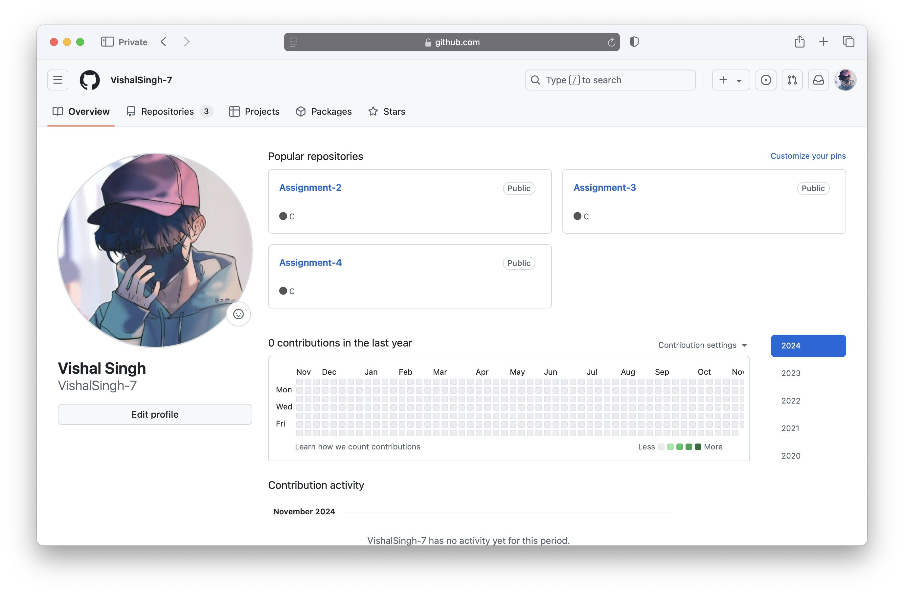
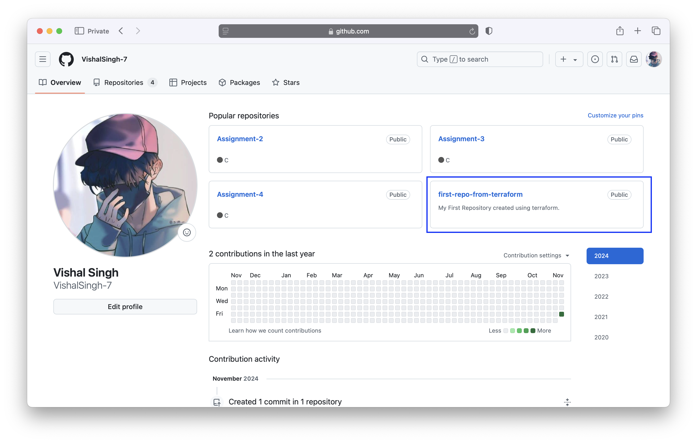

### Create GitHub Repo From Terraform


##### Create a file in a folder with `.tf` extension with the below contents

**main.tf**
```json
provider "github"{
  token="your_github_token_here"
}

resource "github_repository" "terraform-first-repo" {
  name        = "first-repo-from-terraform"
  description = "My First Repository created using terraform."
  visibility = "public"
  auto_init=true

}
```

you can get token value from GitHub setting **[pages](https://github.com/login?return_to=https%3A%2F%2Fgithub.com%2Fsettings%2Ftokens)** and change the name, and description as per your requirement.


##### Terraform Providers:

now let's run terraform providers command and see the output.
```sh
vishalsingh@197NOMBT3987 13_terraform-first-resource % terraform providers

Providers required by configuration:
.
└── provider[registry.terraform.io/hashicorp/github]

The terraform providers command shows information about the provider requirements of the configuration in the current working directory, as an aid to understanding where each requirement was detected from.
```

##### Terraform init:
* This command performs several different initialisation steps in order to prepare the current working directory for use with Terraform.
* This command is always safe to run multiple times, to bring the working directory up to date with changes in the configuration.
* In order to prepare the working directory for use with Terraform, the terraform init command performs the following steps:
    * Backend Initialisation
    * Child Module Installation
    * Plugin Installation

we have very simple configurations as of now (we are not using the child module and backed till now but we will use it in future blogs.) so terraform init just install the plugin.
now let's run terraform init command see the output.

```sh
vishalsingh@197NOMBT3987 13_terraform-first-resource % terraform init
Initializing the backend...
Initializing provider plugins...
- Finding latest version of hashicorp/github...
- Installing hashicorp/github v6.3.1...
- Installed hashicorp/github v6.3.1 (signed by HashiCorp)
Terraform has created a lock file .terraform.lock.hcl to record the provider
selections it made above. Include this file in your version control repository
so that Terraform can guarantee to make the same selections by default when
you run "terraform init" in the future.

╷
│ Warning: Additional provider information from registry
│ 
│ The remote registry returned warnings for registry.terraform.io/hashicorp/github:
│ - For users on Terraform 0.13 or greater, this provider has moved to integrations/github. Please update your source in required_providers.
╵
Terraform has been successfully initialized!

You may now begin working with Terraform. Try running "terraform plan" to see
any changes that are required for your infrastructure. All Terraform commands
should now work.

If you ever set or change modules or backend configuration for Terraform,
rerun this command to reinitialize your working directory. If you forget, other
commands will detect it and remind you to do so if necessary.
```


**provider.tf**
```
provider "github" {
  token = var.token
}
```

**repositories.tf**
```
resource "github_repository" "terraform-first-repo" {
  name        = "first-repo-from-terraform"
  description = "My First Repository created using terraform."
  visibility  = "public"
  auto_init   = true

}

output "terraform-first-repo-url" {
  value = github_repository.terraform-first-repo.html_url
}
```

**terraform.tfvars**
```
  token="your_github_token_here"
```

**variables.tf**
```
variable "token" {}
variable "username" {
  default = "Vishal Singh"
}
variable "age" {
  default = 22
}
variable "city" {
  default = "Agra"
}
```


##### Terraform Plan:**

This command looks in the current working directory for the root module configuration. The terraform plan command creates an execution plan, which lets you preview the changes that Terraform plans to make to your infrastructure. After a successful initialization of the working directory and the completion of the plugin download, we can create an execution plan using terraform plan command, this is a handy way to check whether the execution plan matches your expectations without making any changes to real resources or to the state. By default, when Terraform creates a plan it:
* Reads the current state of any already-existing remote objects to make sure that the Terraform state is up-to-date.
* Compares the current configuration to the prior state and noting any differences.
* Proposes a set of change actions that should, if applied, make the remote objects match the configuration.
* If Terraform detects that no changes are needed to resource instances or to root module output values, terraform plan will report that no actions need to be taken.
* If the Terraform discovers no changes to resources, then the terraform plan indicates that no changes are required to the real infrastructure.
* Terraform also helps to save the plan to a file for later execution with **terrafom apply**, which can be useful while applying automation with Terraform. This can be achieved by using -out argument.

now let's run the terraform plan command and see the output.
```sh
vishalsingh@197NOMBT3987 13_terraform-first-resource % terraform plan

Terraform used the selected providers to generate the following execution plan. Resource actions are indicated with the following symbols:
  + create

Terraform will perform the following actions:

  # github_repository.terraform-first-repo will be created
  + resource "github_repository" "terraform-first-repo" {
      + allow_auto_merge            = false
      + allow_merge_commit          = true
      + allow_rebase_merge          = true
      + allow_squash_merge          = true
      + archived                    = false
      + auto_init                   = true
      + default_branch              = (known after apply)
      + delete_branch_on_merge      = false
      + description                 = "My First Repository created using terraform."
      + etag                        = (known after apply)
      + full_name                   = (known after apply)
      + git_clone_url               = (known after apply)
      + html_url                    = (known after apply)
      + http_clone_url              = (known after apply)
      + id                          = (known after apply)
      + merge_commit_message        = "PR_TITLE"
      + merge_commit_title          = "MERGE_MESSAGE"
      + name                        = "first-repo-from-terraform"
      + node_id                     = (known after apply)
      + primary_language            = (known after apply)
      + private                     = (known after apply)
      + repo_id                     = (known after apply)
      + squash_merge_commit_message = "COMMIT_MESSAGES"
      + squash_merge_commit_title   = "COMMIT_OR_PR_TITLE"
      + ssh_clone_url               = (known after apply)
      + svn_url                     = (known after apply)
      + topics                      = (known after apply)
      + visibility                  = "public"
      + web_commit_signoff_required = false

      + security_and_analysis (known after apply)
    }

Plan: 1 to add, 0 to change, 0 to destroy.

──────────────────────────────────────────────────────────────────────────────────────────────────────────────────────────────────────────────────

Note: You didn't use the -out option to save this plan, so Terraform can't guarantee to take exactly these actions if you run "terraform apply" now.
```

Now let's talk about terraform apply command

##### Terraform apply:
* By default, apply scans the current directory for the configuration and applies the changes appropriately. However, a path to another configuration or an execution plan can be provided.
* Terraform apply command is used to create or introduce changes to real infrastructure.
* By default, apply scans the current working directory for the configuration and applies the changes appropriately.
* However, you'll optionally give the path to a saved plan file that was previously created with terraform plan.
* If you do not provide a plan file on the instruction, terraform apply will create a replacement plan automatically then prompt for approval to use it. If the created plan does not include any changes to resources or to root module output values then terraform apply will exit immediately, without prompting.

```shell
vishalsingh@197NOMBT3987 13_terraform-first-resource % terraform apply

Terraform used the selected providers to generate the following execution plan. Resource actions are indicated with the following symbols:
  + create

Terraform will perform the following actions:

  # github_repository.terraform-first-repo will be created
  + resource "github_repository" "terraform-first-repo" {
      + allow_auto_merge            = false
      + allow_merge_commit          = true
      + allow_rebase_merge          = true
      + allow_squash_merge          = true
      + archived                    = false
      + auto_init                   = true
      + default_branch              = (known after apply)
      + delete_branch_on_merge      = false
      + description                 = "My First Repository created using terraform."
      + etag                        = (known after apply)
      + full_name                   = (known after apply)
      + git_clone_url               = (known after apply)
      + html_url                    = (known after apply)
      + http_clone_url              = (known after apply)
      + id                          = (known after apply)
      + merge_commit_message        = "PR_TITLE"
      + merge_commit_title          = "MERGE_MESSAGE"
      + name                        = "first-repo-from-terraform"
      + node_id                     = (known after apply)
      + primary_language            = (known after apply)
      + private                     = (known after apply)
      + repo_id                     = (known after apply)
      + squash_merge_commit_message = "COMMIT_MESSAGES"
      + squash_merge_commit_title   = "COMMIT_OR_PR_TITLE"
      + ssh_clone_url               = (known after apply)
      + svn_url                     = (known after apply)
      + topics                      = (known after apply)
      + visibility                  = "public"
      + web_commit_signoff_required = false

      + security_and_analysis (known after apply)
    }

Plan: 1 to add, 0 to change, 0 to destroy.

Do you want to perform these actions?
  Terraform will perform the actions described above.
  Only 'yes' will be accepted to approve.

  Enter a value: yes

github_repository.terraform-first-repo: Creating...
github_repository.terraform-first-repo: Creation complete after 6s [id=first-repo-from-terraform]

Apply complete! Resources: 1 added, 0 changed, 0 destroyed.
```


**Screenshots before creating GitHub repositories using terraform:**



**Screenshots after creating GitHub repositories using terraform:**



GitHub Provider:
**[Docs overview | integrations/github | Terraform | Terraform Registry](https://registry.terraform.io/providers/integrations/github/latest/docs)**

