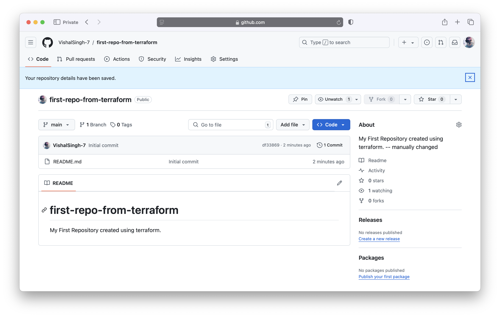
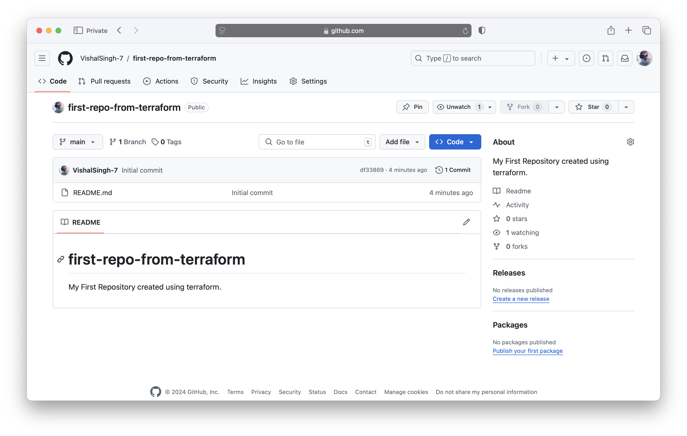

### Terraform Refresh

* The terraform refresh command is used to reconcile the state Terraform knows about (via its state file) with the real-world infrastructure. This can be used to detect any drift from the last-known state, and to update the state file.
* This does not modify infrastructure but does modify the state file. If the state is changed, this may cause changes to occur during the next plan or apply.
* By default, refresh requires no flags and looks in the current directory for the configuration and state file to refresh.


**providers.tf**
```json
provider "github"{
  token="${var.token}"
}
```

**repositories.tf**
```json
resource "github_repository" "terraform-first-repo" {
  name        = "first-repo-from-terraform"
  description = "My First Repository created using terraform."
  visibility = "public"
  auto_init=true

}
```

**variables.tf**
```json
variable token{}
```

**terraform.tfvars**
```
token="your_github_token_here"
```


Changed GitHub repository description manually:



now let's run terraform refresh command in the folder that we created in last videos.

```sh
vishalsingh@197NOMBT3987 13_terraform-first-resource % terraform refresh
github_repository.terraform-first-repo: Refreshing state... [id=first-repo-from-terraform]
vishalsingh@197NOMBT3987 13_terraform-first-resource % terraform show
# github_repository.terraform-first-repo:
resource "github_repository" "terraform-first-repo" {
    allow_auto_merge            = false
    allow_merge_commit          = true
    allow_rebase_merge          = true
    allow_squash_merge          = true
    allow_update_branch         = false
    archived                    = false
    auto_init                   = true
    default_branch              = "main"
    delete_branch_on_merge      = false
    description                 = "My First Repository created using terraform. -- manually changed"
    etag                        = "W/\"be54a221122a259271bfc99adfdcb1ada24fc64e93993cb788e0f5a83ac9c5a6\""
    full_name                   = "VishalSingh-7/first-repo-from-terraform"
    git_clone_url               = "git://github.com/VishalSingh-7/first-repo-from-terraform.git"
    has_discussions             = false
    has_downloads               = false
    has_issues                  = false
    has_projects                = false
    has_wiki                    = false
    homepage_url                = null
    html_url                    = "https://github.com/VishalSingh-7/first-repo-from-terraform"
    http_clone_url              = "https://github.com/VishalSingh-7/first-repo-from-terraform.git"
    id                          = "first-repo-from-terraform"
    is_template                 = false
    merge_commit_message        = "PR_TITLE"
    merge_commit_title          = "MERGE_MESSAGE"
    name                        = "first-repo-from-terraform"
    node_id                     = "R_kgDONPrADQ"
    primary_language            = null
    private                     = false
    repo_id                     = 888848397
    squash_merge_commit_message = "COMMIT_MESSAGES"
    squash_merge_commit_title   = "COMMIT_OR_PR_TITLE"
    ssh_clone_url               = "git@github.com:VishalSingh-7/first-repo-from-terraform.git"
    svn_url                     = "https://github.com/VishalSingh-7/first-repo-from-terraform"
    topics                      = []
    visibility                  = "public"
    vulnerability_alerts        = false
    web_commit_signoff_required = false

    security_and_analysis {
        secret_scanning {
            status = "enabled"
        }
        secret_scanning_push_protection {
            status = "enabled"
        }
    }
}
```

```sh
vishalsingh@197NOMBT3987 13_terraform-first-resource % terraform apply
github_repository.terraform-first-repo: Refreshing state... [id=first-repo-from-terraform]

Terraform used the selected providers to generate the following execution plan. Resource actions are indicated with the following symbols:
  ~ update in-place

Terraform will perform the following actions:

  # github_repository.terraform-first-repo will be updated in-place
  ~ resource "github_repository" "terraform-first-repo" {
      ~ description                 = "My First Repository created using terraform. -- manually changed" -> "My First Repository created using terraform."
        id                          = "first-repo-from-terraform"
        name                        = "first-repo-from-terraform"
        # (35 unchanged attributes hidden)

        # (1 unchanged block hidden)
    }

Plan: 0 to add, 1 to change, 0 to destroy.

Do you want to perform these actions?
  Terraform will perform the actions described above.
  Only 'yes' will be accepted to approve.

  Enter a value: yes

github_repository.terraform-first-repo: Modifying... [id=first-repo-from-terraform]
github_repository.terraform-first-repo: Modifications complete after 3s [id=first-repo-from-terraform]

Apply complete! Resources: 0 added, 1 changed, 0 destroyed.


```

**After applying the above command:**

