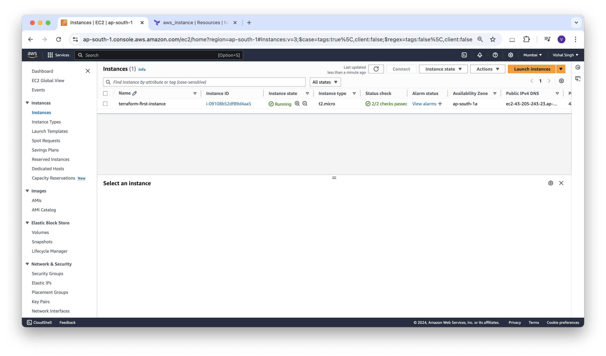

### Create First AWS Resource

Let's create a directory with name **aws-first-instance**

```sh
mkdir aws-first-instance
```

let's create a file with the name provider.tf (you can change the name of the file as per your requirement.) with the below content.

**provider.tf**
```json
#Configure the AWS Provider
provider "aws" {
  region     = "ap-south-1"
  access_key = "your_access_key_here"
  secret_key = "your_secret_key_here"
}
```

put your access key and secret key that you get from aws.

now we are going to create an instance on AWS so let's create one more file in the same directory named as instance.tf with the below content

**instance.tf**
```json
resource "aws_instance" "terraform-first-instance" {
  ami           = "ami-0aebec83a182ea7ea"
  instance_type = "t2.micro"
  tags = {
    Name = "terraform-first-instance"
  }
}
```

now let's run terraform init command.
```sh
vishalsingh@197NOMBT3987 14_aws-first-instance % terraform init
Initializing the backend...
Initializing provider plugins...
- Finding latest version of hashicorp/aws...
- Installing hashicorp/aws v5.76.0...
- Installed hashicorp/aws v5.76.0 (signed by HashiCorp)
Terraform has created a lock file .terraform.lock.hcl to record the provider
selections it made above. Include this file in your version control repository
so that Terraform can guarantee to make the same selections by default when
you run "terraform init" in the future.

Terraform has been successfully initialized!

You may now begin working with Terraform. Try running "terraform plan" to see
any changes that are required for your infrastructure. All Terraform commands
should now work.

If you ever set or change modules or backend configuration for Terraform,
rerun this command to reinitialize your working directory. If you forget, other
commands will detect it and remind you to do so if necessary.
vishalsingh@197NOMBT3987 14_aws-first-instance % terraform providers

Providers required by configuration:
.
└── provider[registry.terraform.io/hashicorp/aws]
```

```sh
vishalsingh@197NOMBT3987 14_aws-first-instance % terraform plan

Terraform used the selected providers to generate the following execution plan. Resource actions are indicated with the following symbols:
  + create

Terraform will perform the following actions:

  # aws_instance.terraform-first-instance will be created
  + resource "aws_instance" "terraform-first-instance" {
      + ami                                  = "ami-0aebec83a182ea7ea"
      + arn                                  = (known after apply)
      + associate_public_ip_address          = (known after apply)
      + availability_zone                    = (known after apply)
      + cpu_core_count                       = (known after apply)
      + cpu_threads_per_core                 = (known after apply)
      + disable_api_stop                     = (known after apply)
      + disable_api_termination              = (known after apply)
      + ebs_optimized                        = (known after apply)
      + get_password_data                    = false
      + host_id                              = (known after apply)
      + host_resource_group_arn              = (known after apply)
      + iam_instance_profile                 = (known after apply)
      + id                                   = (known after apply)
      + instance_initiated_shutdown_behavior = (known after apply)
      + instance_lifecycle                   = (known after apply)
      + instance_state                       = (known after apply)
      + instance_type                        = "t2.micro"
      + ipv6_address_count                   = (known after apply)
      + ipv6_addresses                       = (known after apply)
      + key_name                             = (known after apply)
      + monitoring                           = (known after apply)
      + outpost_arn                          = (known after apply)
      + password_data                        = (known after apply)
      + placement_group                      = (known after apply)
      + placement_partition_number           = (known after apply)
      + primary_network_interface_id         = (known after apply)
      + private_dns                          = (known after apply)
      + private_ip                           = (known after apply)
      + public_dns                           = (known after apply)
      + public_ip                            = (known after apply)
      + secondary_private_ips                = (known after apply)
      + security_groups                      = (known after apply)
      + source_dest_check                    = true
      + spot_instance_request_id             = (known after apply)
      + subnet_id                            = (known after apply)
      + tags                                 = {
          + "Name" = "terraform-first-instance"
        }
      + tags_all                             = {
          + "Name" = "terraform-first-instance"
        }
      + tenancy                              = (known after apply)
      + user_data                            = (known after apply)
      + user_data_base64                     = (known after apply)
      + user_data_replace_on_change          = false
      + vpc_security_group_ids               = (known after apply)

      + capacity_reservation_specification (known after apply)

      + cpu_options (known after apply)

      + ebs_block_device (known after apply)

      + enclave_options (known after apply)

      + ephemeral_block_device (known after apply)

      + instance_market_options (known after apply)

      + maintenance_options (known after apply)

      + metadata_options (known after apply)

      + network_interface (known after apply)

      + private_dns_name_options (known after apply)

      + root_block_device (known after apply)
    }

Plan: 1 to add, 0 to change, 0 to destroy.

──────────────────────────────────────────────────────────────────────────────────────────────────────────────────────────────────────────────────

Note: You didn't use the -out option to save this plan, so Terraform can't guarantee to take exactly these actions if you run "terraform apply" now.
```

```sh
vishalsingh@197NOMBT3987 14_aws-first-instance % terraform apply

Terraform used the selected providers to generate the following execution plan. Resource actions are indicated with the following symbols:
  + create

Terraform will perform the following actions:

  # aws_instance.terraform-first-instance will be created
  + resource "aws_instance" "terraform-first-instance" {
      + ami                                  = "ami-0aebec83a182ea7ea"
      + arn                                  = (known after apply)
      + associate_public_ip_address          = (known after apply)
      + availability_zone                    = (known after apply)
      + cpu_core_count                       = (known after apply)
      + cpu_threads_per_core                 = (known after apply)
      + disable_api_stop                     = (known after apply)
      + disable_api_termination              = (known after apply)
      + ebs_optimized                        = (known after apply)
      + get_password_data                    = false
      + host_id                              = (known after apply)
      + host_resource_group_arn              = (known after apply)
      + iam_instance_profile                 = (known after apply)
      + id                                   = (known after apply)
      + instance_initiated_shutdown_behavior = (known after apply)
      + instance_lifecycle                   = (known after apply)
      + instance_state                       = (known after apply)
      + instance_type                        = "t2.micro"
      + ipv6_address_count                   = (known after apply)
      + ipv6_addresses                       = (known after apply)
      + key_name                             = (known after apply)
      + monitoring                           = (known after apply)
      + outpost_arn                          = (known after apply)
      + password_data                        = (known after apply)
      + placement_group                      = (known after apply)
      + placement_partition_number           = (known after apply)
      + primary_network_interface_id         = (known after apply)
      + private_dns                          = (known after apply)
      + private_ip                           = (known after apply)
      + public_dns                           = (known after apply)
      + public_ip                            = (known after apply)
      + secondary_private_ips                = (known after apply)
      + security_groups                      = (known after apply)
      + source_dest_check                    = true
      + spot_instance_request_id             = (known after apply)
      + subnet_id                            = (known after apply)
      + tags                                 = {
          + "Name" = "terraform-first-instance"
        }
      + tags_all                             = {
          + "Name" = "terraform-first-instance"
        }
      + tenancy                              = (known after apply)
      + user_data                            = (known after apply)
      + user_data_base64                     = (known after apply)
      + user_data_replace_on_change          = false
      + vpc_security_group_ids               = (known after apply)

      + capacity_reservation_specification (known after apply)

      + cpu_options (known after apply)

      + ebs_block_device (known after apply)

      + enclave_options (known after apply)

      + ephemeral_block_device (known after apply)

      + instance_market_options (known after apply)

      + maintenance_options (known after apply)

      + metadata_options (known after apply)

      + network_interface (known after apply)

      + private_dns_name_options (known after apply)

      + root_block_device (known after apply)
    }

Plan: 1 to add, 0 to change, 0 to destroy.

Do you want to perform these actions?
  Terraform will perform the actions described above.
  Only 'yes' will be accepted to approve.

  Enter a value: yes

aws_instance.terraform-first-instance: Creating...
aws_instance.terraform-first-instance: Still creating... [10s elapsed]
aws_instance.terraform-first-instance: Still creating... [20s elapsed]
aws_instance.terraform-first-instance: Still creating... [30s elapsed]
aws_instance.terraform-first-instance: Creation complete after 32s [id=i-09108b52df89d4aa5]

Apply complete! Resources: 1 added, 0 changed, 0 destroyed.
```



```sh
vishalsingh@197NOMBT3987 14_aws-first-instance % terraform destroy
aws_instance.terraform-first-instance: Refreshing state... [id=i-09108b52df89d4aa5]

Terraform used the selected providers to generate the following execution plan. Resource actions are indicated with the following symbols:
  - destroy

Terraform will perform the following actions:

  # aws_instance.terraform-first-instance will be destroyed
  - resource "aws_instance" "terraform-first-instance" {
      - ami                                  = "ami-0aebec83a182ea7ea" -> null
      - arn                                  = "arn:aws:ec2:ap-south-1:108333147495:instance/i-09108b52df89d4aa5" -> null
      - associate_public_ip_address          = true -> null
      - availability_zone                    = "ap-south-1a" -> null
      - cpu_core_count                       = 1 -> null
      - cpu_threads_per_core                 = 1 -> null
      - disable_api_stop                     = false -> null
      - disable_api_termination              = false -> null
      - ebs_optimized                        = false -> null
      - get_password_data                    = false -> null
      - hibernation                          = false -> null
      - id                                   = "i-09108b52df89d4aa5" -> null
      - instance_initiated_shutdown_behavior = "stop" -> null
      - instance_state                       = "running" -> null
      - instance_type                        = "t2.micro" -> null
      - ipv6_address_count                   = 0 -> null
      - ipv6_addresses                       = [] -> null
      - monitoring                           = false -> null
      - placement_partition_number           = 0 -> null
      - primary_network_interface_id         = "eni-0efb0ae93ec21cf4b" -> null
      - private_dns                          = "ip-172-31-41-40.ap-south-1.compute.internal" -> null
      - private_ip                           = "172.31.41.40" -> null
      - public_dns                           = "ec2-43-205-243-23.ap-south-1.compute.amazonaws.com" -> null
      - public_ip                            = "43.205.243.23" -> null
      - secondary_private_ips                = [] -> null
      - security_groups                      = [
          - "default",
        ] -> null
      - source_dest_check                    = true -> null
      - subnet_id                            = "subnet-0b614459ff3b519e1" -> null
      - tags                                 = {
          - "Name" = "terraform-first-instance"
        } -> null
      - tags_all                             = {
          - "Name" = "terraform-first-instance"
        } -> null
      - tenancy                              = "default" -> null
      - user_data_replace_on_change          = false -> null
      - vpc_security_group_ids               = [
          - "sg-0305d32785d2d91c8",
        ] -> null
        # (8 unchanged attributes hidden)

      - capacity_reservation_specification {
          - capacity_reservation_preference = "open" -> null
        }

      - cpu_options {
          - core_count       = 1 -> null
          - threads_per_core = 1 -> null
            # (1 unchanged attribute hidden)
        }

      - credit_specification {
          - cpu_credits = "standard" -> null
        }

      - enclave_options {
          - enabled = false -> null
        }

      - maintenance_options {
          - auto_recovery = "default" -> null
        }

      - metadata_options {
          - http_endpoint               = "enabled" -> null
          - http_protocol_ipv6          = "disabled" -> null
          - http_put_response_hop_limit = 2 -> null
          - http_tokens                 = "required" -> null
          - instance_metadata_tags      = "disabled" -> null
        }

      - private_dns_name_options {
          - enable_resource_name_dns_a_record    = false -> null
          - enable_resource_name_dns_aaaa_record = false -> null
          - hostname_type                        = "ip-name" -> null
        }

      - root_block_device {
          - delete_on_termination = true -> null
          - device_name           = "/dev/xvda" -> null
          - encrypted             = false -> null
          - iops                  = 3000 -> null
          - tags                  = {} -> null
          - tags_all              = {} -> null
          - throughput            = 125 -> null
          - volume_id             = "vol-01d78f7631343ca86" -> null
          - volume_size           = 8 -> null
          - volume_type           = "gp3" -> null
            # (1 unchanged attribute hidden)
        }
    }

Plan: 0 to add, 0 to change, 1 to destroy.

Do you really want to destroy all resources?
  Terraform will destroy all your managed infrastructure, as shown above.
  There is no undo. Only 'yes' will be accepted to confirm.

  Enter a value: yes

aws_instance.terraform-first-instance: Destroying... [id=i-09108b52df89d4aa5]
aws_instance.terraform-first-instance: Still destroying... [id=i-09108b52df89d4aa5, 10s elapsed]
aws_instance.terraform-first-instance: Still destroying... [id=i-09108b52df89d4aa5, 20s elapsed]
aws_instance.terraform-first-instance: Still destroying... [id=i-09108b52df89d4aa5, 30s elapsed]
aws_instance.terraform-first-instance: Still destroying... [id=i-09108b52df89d4aa5, 40s elapsed]
aws_instance.terraform-first-instance: Destruction complete after 40s

Destroy complete! Resources: 1 destroyed.

