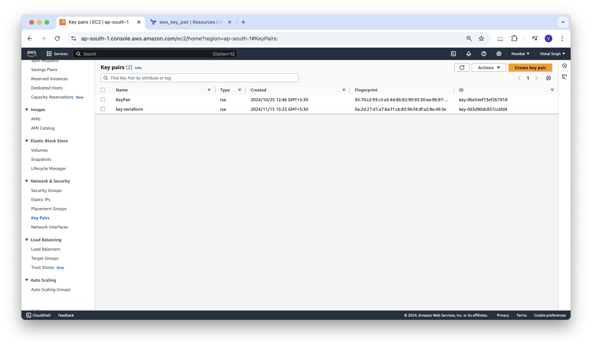

### Create an SSH key in AWS using Terraform

In this blog, we are going to create an ssh key on AWS and assign it to a newly created AWS instance.

Let's create an ssh keypair on our local system using the **ssh-keygen** command

```sh
vishalsingh@197NOMBT3987 14_aws-first-instance % ls
instance.tf                     provider.tf                     terraform.tfstate               terraform.tfstate.backup

vishalsingh@197NOMBT3987 14_aws-first-instance % ssh-keygen -t rsa
Generating public/private rsa key pair.
Enter file in which to save the key (/Users/vishalsingh/.ssh/id_rsa): ./id_rsa
Enter passphrase (empty for no passphrase): 
Enter same passphrase again: 
Your identification has been saved in ./id_rsa
Your public key has been saved in ./id_rsa.pub
The key fingerprint is:
SHA256:Tj/Namu+0W80kqN5Rf/geoAn9VWfpT2H5OabQ6OmMCs vishalsingh@197NOMBT3987
The key's randomart image is:
+---[RSA 3072]----+
|                 |
|              . o|
|             o +=|
|            . *o=|
|        S  o * oo|
|       o .o+* X .|
|        + +=+X *.|
|      E  +=++.B .|
|       ..+**.+.. |
+----[SHA256]-----+

vishalsingh@197NOMBT3987 14_aws-first-instance % ls
id_rsa                          instance.tf                     terraform.tfstate
id_rsa.pub                      provider.tf                     terraform.tfstate.backup
```

now we can see that **id_rsa** and **id_rsa.pub** files were created.

now let's create a file **aws-kp.tf** with the below content.
```json
# Creating ssh-key
resource "aws_key_pair" "key-terraform" {
  key_name   = "deployer-key"
  public_key = file("${path.module}/id_rsa.pub")
}
```


now let's run terraform plan and apply the command we can see that the new key pair create on aws.

```sh
vishalsingh@197NOMBT3987 14_aws-first-instance % terraform plan

Terraform used the selected providers to generate the following execution plan. Resource actions are indicated with the following symbols:
  + create

Terraform will perform the following actions:

  # aws_key_pair.key-terraform will be created
  + resource "aws_key_pair" "key-terraform" {
      + arn             = (known after apply)
      + fingerprint     = (known after apply)
      + id              = (known after apply)
      + key_name        = "key-terraform"
      + key_name_prefix = (known after apply)
      + key_pair_id     = (known after apply)
      + key_type        = (known after apply)
      + public_key      = "your_ssh_key_here"
      + tags_all        = (known after apply)
    }

Plan: 1 to add, 0 to change, 0 to destroy.

Changes to Outputs:
  + keyname = "key-terraform"

──────────────────────────────────────────────────────────────────────────────────────────────────────────────────────────────────────────────────

Note: You didn't use the -out option to save this plan, so Terraform can't guarantee to take exactly these actions if you run "terraform apply" now.
```

```sh
vishalsingh@197NOMBT3987 14_aws-first-instance % terraform apply

Terraform used the selected providers to generate the following execution plan. Resource actions are indicated with the following symbols:
  + create

Terraform will perform the following actions:

  # aws_key_pair.key-terraform will be created
  + resource "aws_key_pair" "key-terraform" {
      + arn             = (known after apply)
      + fingerprint     = (known after apply)
      + id              = (known after apply)
      + key_name        = "key-terraform"
      + key_name_prefix = (known after apply)
      + key_pair_id     = (known after apply)
      + key_type        = (known after apply)
      + public_key      = "your_ssh_key_here"
      + tags_all        = (known after apply)
    }

Plan: 1 to add, 0 to change, 0 to destroy.

Changes to Outputs:
  + keyname = "key-terraform"

Do you want to perform these actions?
  Terraform will perform the actions described above.
  Only 'yes' will be accepted to approve.

  Enter a value: yes

aws_key_pair.key-terraform: Creating...
aws_key_pair.key-terraform: Creation complete after 0s [id=key-terraform]

Apply complete! Resources: 1 added, 0 changed, 0 destroyed.

Outputs:

keyname = "key-terraform"
```



```sh
vishalsingh@197NOMBT3987 14_aws-first-instance % terraform destroy
aws_key_pair.key-terraform: Refreshing state... [id=key-terraform]

Terraform used the selected providers to generate the following execution plan. Resource actions are indicated with the following symbols:
  - destroy

Terraform will perform the following actions:

  # aws_key_pair.key-terraform will be destroyed
  - resource "aws_key_pair" "key-terraform" {
      - arn             = "arn:aws:ec2:ap-south-1:108333147495:key-pair/key-terraform" -> null
      - fingerprint     = "0a:2d:27:d1:a7:6a:f1:cb:83:9b:f4:df:a2:8e:49:3e" -> null
      - id              = "key-terraform" -> null
      - key_name        = "key-terraform" -> null
      - key_pair_id     = "key-0d3d90dc837ccafd4" -> null
      - key_type        = "rsa" -> null
      - public_key      = "your_ssh_key_here" -> null
      - tags            = {} -> null
      - tags_all        = {} -> null
        # (1 unchanged attribute hidden)
    }

Plan: 0 to add, 0 to change, 1 to destroy.

Changes to Outputs:
  - keyname = "key-terraform" -> null

Do you really want to destroy all resources?
  Terraform will destroy all your managed infrastructure, as shown above.
  There is no undo. Only 'yes' will be accepted to confirm.

  Enter a value: yes

aws_key_pair.key-terraform: Destroying... [id=key-terraform]
aws_key_pair.key-terraform: Destruction complete after 1s

Destroy complete! Resources: 1 destroyed.

