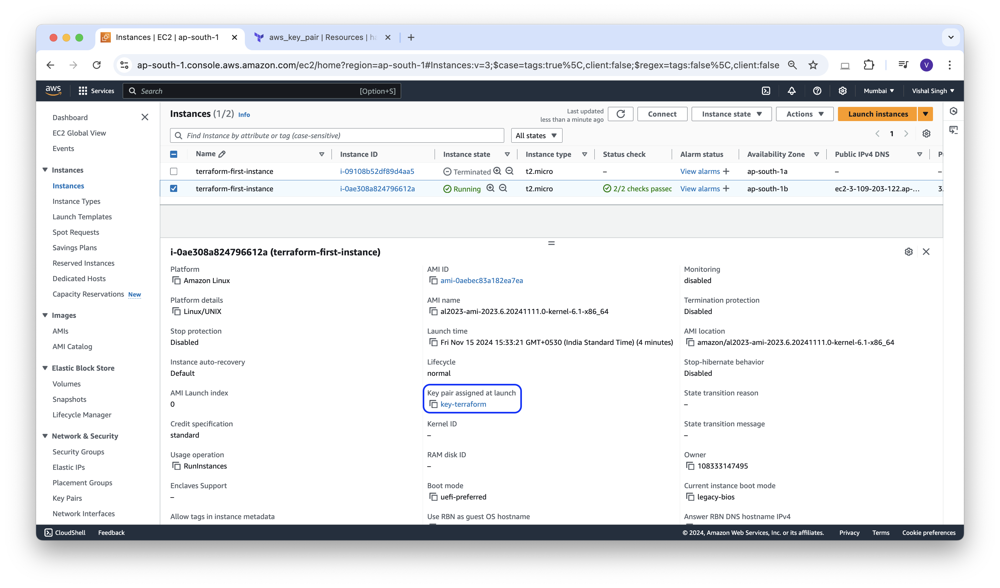

### Assign SSH-key to AWS Instance Using Terraform

In the last blog we create a key pair, in this blog, we will assign that key to the AWS instance. let's modify the **instance.tf** file(that we created in the previous blog) with the below content, and make sure in your current directory have `id_rsa`, `id_rsa.pub`, `provider.tf`, `instance.tf`, `aws-kp.tf` that we created in previous blogs.

**instance.tf**
```json
# Creating ssh-key
resource "aws_key_pair" "key-terraform" {
  key_name   = "key-terraform"
  public_key = file("${path.module}/id_rsa.pub")
}

# Creating instance
resource "aws_instance" "terraform-first-instance" {
  ami           = "ami-0aebec83a182ea7ea"
  instance_type = "t2.micro"
  key_name = "${aws_key_pair.key-terraform.key_name}"
  tags = {
    Name = "terraform-first-instance"
  }
}
```

first, destroy the instance that we created in previous blogs using terraform destroy command. and run terraform apply command and verify that new instance created and `ssh` key assigned to that instance.
you can `ssh` that instance with the help of that `id_rsa` key.

**Example**
```sh
ssh -i id_rsa username@ipAddressOfInstance
```


**Output:**
```sh
vishalsingh@197NOMBT3987 14_aws-first-instance % terraform plan

Terraform used the selected providers to generate the following execution plan. Resource actions are indicated with the following symbols:
  + create

Terraform will perform the following actions:

  # aws_instance.terraform-first-instance will be created
  + resource "aws_instance" "terraform-first-instance" {
      + ami                                  = "ami-0aebec83a182ea7ea"
      + arn                                  = (known after apply)
      + associate_public_ip_address          = (known after apply)
      + availability_zone                    = (known after apply)
      + cpu_core_count                       = (known after apply)
      + cpu_threads_per_core                 = (known after apply)
      + disable_api_stop                     = (known after apply)
      + disable_api_termination              = (known after apply)
      + ebs_optimized                        = (known after apply)
      + get_password_data                    = false
      + host_id                              = (known after apply)
      + host_resource_group_arn              = (known after apply)
      + iam_instance_profile                 = (known after apply)
      + id                                   = (known after apply)
      + instance_initiated_shutdown_behavior = (known after apply)
      + instance_lifecycle                   = (known after apply)
      + instance_state                       = (known after apply)
      + instance_type                        = "t2.micro"
      + ipv6_address_count                   = (known after apply)
      + ipv6_addresses                       = (known after apply)
      + key_name                             = "key-terraform"
      + monitoring                           = (known after apply)
      + outpost_arn                          = (known after apply)
      + password_data                        = (known after apply)
      + placement_group                      = (known after apply)
      + placement_partition_number           = (known after apply)
      + primary_network_interface_id         = (known after apply)
      + private_dns                          = (known after apply)
      + private_ip                           = (known after apply)
      + public_dns                           = (known after apply)
      + public_ip                            = (known after apply)
      + secondary_private_ips                = (known after apply)
      + security_groups                      = (known after apply)
      + source_dest_check                    = true
      + spot_instance_request_id             = (known after apply)
      + subnet_id                            = (known after apply)
      + tags                                 = {
          + "Name" = "terraform-first-instance"
        }
      + tags_all                             = {
          + "Name" = "terraform-first-instance"
        }
      + tenancy                              = (known after apply)
      + user_data                            = (known after apply)
      + user_data_base64                     = (known after apply)
      + user_data_replace_on_change          = false
      + vpc_security_group_ids               = (known after apply)

      + capacity_reservation_specification (known after apply)

      + cpu_options (known after apply)

      + ebs_block_device (known after apply)

      + enclave_options (known after apply)

      + ephemeral_block_device (known after apply)

      + instance_market_options (known after apply)

      + maintenance_options (known after apply)

      + metadata_options (known after apply)

      + network_interface (known after apply)

      + private_dns_name_options (known after apply)

      + root_block_device (known after apply)
    }

  # aws_key_pair.key-terraform will be created
  + resource "aws_key_pair" "key-terraform" {
      + arn             = (known after apply)
      + fingerprint     = (known after apply)
      + id              = (known after apply)
      + key_name        = "key-terraform"
      + key_name_prefix = (known after apply)
      + key_pair_id     = (known after apply)
      + key_type        = (known after apply)
      + public_key      = "your_ssh_key_here"
      + tags_all        = (known after apply)
    }

Plan: 2 to add, 0 to change, 0 to destroy.

──────────────────────────────────────────────────────────────────────────────────────────────────────────────────────────────────────────────────

Note: You didn't use the -out option to save this plan, so Terraform can't guarantee to take exactly these actions if you run "terraform apply" now.
```

```sh
vishalsingh@197NOMBT3987 14_aws-first-instance % terraform apply

Terraform used the selected providers to generate the following execution plan. Resource actions are indicated with the following symbols:
  + create

Terraform will perform the following actions:

  # aws_instance.terraform-first-instance will be created
  + resource "aws_instance" "terraform-first-instance" {
      + ami                                  = "ami-0aebec83a182ea7ea"
      + arn                                  = (known after apply)
      + associate_public_ip_address          = (known after apply)
      + availability_zone                    = (known after apply)
      + cpu_core_count                       = (known after apply)
      + cpu_threads_per_core                 = (known after apply)
      + disable_api_stop                     = (known after apply)
      + disable_api_termination              = (known after apply)
      + ebs_optimized                        = (known after apply)
      + get_password_data                    = false
      + host_id                              = (known after apply)
      + host_resource_group_arn              = (known after apply)
      + iam_instance_profile                 = (known after apply)
      + id                                   = (known after apply)
      + instance_initiated_shutdown_behavior = (known after apply)
      + instance_lifecycle                   = (known after apply)
      + instance_state                       = (known after apply)
      + instance_type                        = "t2.micro"
      + ipv6_address_count                   = (known after apply)
      + ipv6_addresses                       = (known after apply)
      + key_name                             = "key-terraform"
      + monitoring                           = (known after apply)
      + outpost_arn                          = (known after apply)
      + password_data                        = (known after apply)
      + placement_group                      = (known after apply)
      + placement_partition_number           = (known after apply)
      + primary_network_interface_id         = (known after apply)
      + private_dns                          = (known after apply)
      + private_ip                           = (known after apply)
      + public_dns                           = (known after apply)
      + public_ip                            = (known after apply)
      + secondary_private_ips                = (known after apply)
      + security_groups                      = (known after apply)
      + source_dest_check                    = true
      + spot_instance_request_id             = (known after apply)
      + subnet_id                            = (known after apply)
      + tags                                 = {
          + "Name" = "terraform-first-instance"
        }
      + tags_all                             = {
          + "Name" = "terraform-first-instance"
        }
      + tenancy                              = (known after apply)
      + user_data                            = (known after apply)
      + user_data_base64                     = (known after apply)
      + user_data_replace_on_change          = false
      + vpc_security_group_ids               = (known after apply)

      + capacity_reservation_specification (known after apply)

      + cpu_options (known after apply)

      + ebs_block_device (known after apply)

      + enclave_options (known after apply)

      + ephemeral_block_device (known after apply)

      + instance_market_options (known after apply)

      + maintenance_options (known after apply)

      + metadata_options (known after apply)

      + network_interface (known after apply)

      + private_dns_name_options (known after apply)

      + root_block_device (known after apply)
    }

  # aws_key_pair.key-terraform will be created
  + resource "aws_key_pair" "key-terraform" {
      + arn             = (known after apply)
      + fingerprint     = (known after apply)
      + id              = (known after apply)
      + key_name        = "key-terraform"
      + key_name_prefix = (known after apply)
      + key_pair_id     = (known after apply)
      + key_type        = (known after apply)
      + public_key      = "your_ssh_key_here"
      + tags_all        = (known after apply)
    }

Plan: 2 to add, 0 to change, 0 to destroy.

Do you want to perform these actions?
  Terraform will perform the actions described above.
  Only 'yes' will be accepted to approve.

  Enter a value: yes

aws_key_pair.key-terraform: Creating...
aws_key_pair.key-terraform: Creation complete after 0s [id=key-terraform]
aws_instance.terraform-first-instance: Creating...
aws_instance.terraform-first-instance: Still creating... [10s elapsed]
aws_instance.terraform-first-instance: Creation complete after 13s [id=i-0ae308a824796612a]

Apply complete! Resources: 2 added, 0 changed, 0 destroyed.
```



```sh
vishalsingh@197NOMBT3987 14_aws-first-instance % terraform destroy
aws_key_pair.key-terraform: Refreshing state... [id=key-terraform]
aws_instance.terraform-first-instance: Refreshing state... [id=i-0ae308a824796612a]

Terraform used the selected providers to generate the following execution plan. Resource actions are indicated with the following symbols:
  - destroy

Terraform will perform the following actions:

  # aws_instance.terraform-first-instance will be destroyed
  - resource "aws_instance" "terraform-first-instance" {
      - ami                                  = "ami-0aebec83a182ea7ea" -> null
      - arn                                  = "arn:aws:ec2:ap-south-1:108333147495:instance/i-0ae308a824796612a" -> null
      - associate_public_ip_address          = true -> null
      - availability_zone                    = "ap-south-1b" -> null
      - cpu_core_count                       = 1 -> null
      - cpu_threads_per_core                 = 1 -> null
      - disable_api_stop                     = false -> null
      - disable_api_termination              = false -> null
      - ebs_optimized                        = false -> null
      - get_password_data                    = false -> null
      - hibernation                          = false -> null
      - id                                   = "i-0ae308a824796612a" -> null
      - instance_initiated_shutdown_behavior = "stop" -> null
      - instance_state                       = "running" -> null
      - instance_type                        = "t2.micro" -> null
      - ipv6_address_count                   = 0 -> null
      - ipv6_addresses                       = [] -> null
      - key_name                             = "key-terraform" -> null
      - monitoring                           = false -> null
      - placement_partition_number           = 0 -> null
      - primary_network_interface_id         = "eni-0659ee204d3df416d" -> null
      - private_dns                          = "ip-172-31-6-233.ap-south-1.compute.internal" -> null
      - private_ip                           = "172.31.6.233" -> null
      - public_dns                           = "ec2-3-109-203-122.ap-south-1.compute.amazonaws.com" -> null
      - public_ip                            = "3.109.203.122" -> null
      - secondary_private_ips                = [] -> null
      - security_groups                      = [
          - "default",
        ] -> null
      - source_dest_check                    = true -> null
      - subnet_id                            = "subnet-05c15c9e536c20a9b" -> null
      - tags                                 = {
          - "Name" = "terraform-first-instance"
        } -> null
      - tags_all                             = {
          - "Name" = "terraform-first-instance"
        } -> null
      - tenancy                              = "default" -> null
      - user_data_replace_on_change          = false -> null
      - vpc_security_group_ids               = [
          - "sg-0305d32785d2d91c8",
        ] -> null
        # (7 unchanged attributes hidden)

      - capacity_reservation_specification {
          - capacity_reservation_preference = "open" -> null
        }

      - cpu_options {
          - core_count       = 1 -> null
          - threads_per_core = 1 -> null
            # (1 unchanged attribute hidden)
        }

      - credit_specification {
          - cpu_credits = "standard" -> null
        }

      - enclave_options {
          - enabled = false -> null
        }

      - maintenance_options {
          - auto_recovery = "default" -> null
        }

      - metadata_options {
          - http_endpoint               = "enabled" -> null
          - http_protocol_ipv6          = "disabled" -> null
          - http_put_response_hop_limit = 2 -> null
          - http_tokens                 = "required" -> null
          - instance_metadata_tags      = "disabled" -> null
        }

      - private_dns_name_options {
          - enable_resource_name_dns_a_record    = false -> null
          - enable_resource_name_dns_aaaa_record = false -> null
          - hostname_type                        = "ip-name" -> null
        }

      - root_block_device {
          - delete_on_termination = true -> null
          - device_name           = "/dev/xvda" -> null
          - encrypted             = false -> null
          - iops                  = 3000 -> null
          - tags                  = {} -> null
          - tags_all              = {} -> null
          - throughput            = 125 -> null
          - volume_id             = "vol-09df07d0ae4524e49" -> null
          - volume_size           = 8 -> null
          - volume_type           = "gp3" -> null
            # (1 unchanged attribute hidden)
        }
    }

  # aws_key_pair.key-terraform will be destroyed
  - resource "aws_key_pair" "key-terraform" {
      - arn             = "arn:aws:ec2:ap-south-1:108333147495:key-pair/key-terraform" -> null
      - fingerprint     = "0a:2d:27:d1:a7:6a:f1:cb:83:9b:f4:df:a2:8e:49:3e" -> null
      - id              = "key-terraform" -> null
      - key_name        = "key-terraform" -> null
      - key_pair_id     = "key-098a93fe971c78c9c" -> null
      - key_type        = "rsa" -> null
      - public_key      = "your_ssh_key_here" -> null
      - tags            = {} -> null
      - tags_all        = {} -> null
        # (1 unchanged attribute hidden)
    }

Plan: 0 to add, 0 to change, 2 to destroy.

Do you really want to destroy all resources?
  Terraform will destroy all your managed infrastructure, as shown above.
  There is no undo. Only 'yes' will be accepted to confirm.

  Enter a value: yes

aws_instance.terraform-first-instance: Destroying... [id=i-0ae308a824796612a]
aws_instance.terraform-first-instance: Still destroying... [id=i-0ae308a824796612a, 10s elapsed]
aws_instance.terraform-first-instance: Still destroying... [id=i-0ae308a824796612a, 20s elapsed]
aws_instance.terraform-first-instance: Still destroying... [id=i-0ae308a824796612a, 30s elapsed]
aws_instance.terraform-first-instance: Still destroying... [id=i-0ae308a824796612a, 40s elapsed]
aws_instance.terraform-first-instance: Still destroying... [id=i-0ae308a824796612a, 50s elapsed]
aws_instance.terraform-first-instance: Still destroying... [id=i-0ae308a824796612a, 1m0s elapsed]
aws_instance.terraform-first-instance: Still destroying... [id=i-0ae308a824796612a, 1m10s elapsed]
aws_instance.terraform-first-instance: Still destroying... [id=i-0ae308a824796612a, 1m20s elapsed]
aws_instance.terraform-first-instance: Destruction complete after 1m21s
aws_key_pair.key-terraform: Destroying... [id=key-terraform]
aws_key_pair.key-terraform: Destruction complete after 0s

Destroy complete! Resources: 2 destroyed.

```


