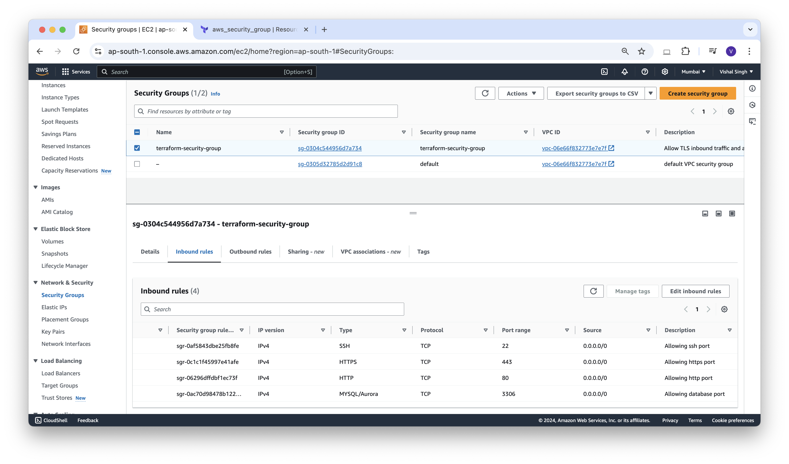

### Creating Security Group

**instance.tf**
```json
# Creating Security Group
resource "aws_security_group" "terraform-security-group" {
  name        = "terraform-security-group"
  description = "Allow TLS inbound traffic and all outbound traffic"
  ingress{
    description="Allowing ssh port"
    from_port        = 22
    to_port          = 22
    protocol         = "tcp"
    cidr_blocks      = ["0.0.0.0/0"]
  }
  ingress{
    description="Allowing http port"
    from_port        = 80
    to_port          = 80
    protocol         = "tcp"
    cidr_blocks      = ["0.0.0.0/0"]
  }
  ingress{
    description="Allowing https port"
    from_port        = 443
    to_port          = 443
    protocol         = "tcp"
    cidr_blocks      = ["0.0.0.0/0"]
  }
  ingress{
    description="Allowing database port"
    from_port        = 3306
    to_port          = 3306
    protocol         = "tcp"
    cidr_blocks      = ["0.0.0.0/0"]
  }
  egress {
    from_port        = 0
    to_port          = 0
    protocol         = "-1"
    cidr_blocks      = ["0.0.0.0/0"]
    ipv6_cidr_blocks = ["::/0"]
  }
  tags = {
    Name = "terraform-security-group"
  }
}
```


**Output:**
```sh
vishalsingh@197NOMBT3987 14_aws-first-instance % terraform validate
Success! The configuration is valid.
```

```sh
vishalsingh@197NOMBT3987 14_aws-first-instance % terraform plan

Terraform used the selected providers to generate the following execution plan. Resource actions are indicated with the following symbols:
  + create

Terraform will perform the following actions:

  # aws_security_group.terraform-security-group will be created
  + resource "aws_security_group" "terraform-security-group" {
      + arn                    = (known after apply)
      + description            = "Allow TLS inbound traffic and all outbound traffic"
      + egress                 = [
          + {
              + cidr_blocks      = [
                  + "0.0.0.0/0",
                ]
              + from_port        = 0
              + ipv6_cidr_blocks = [
                  + "::/0",
                ]
              + prefix_list_ids  = []
              + protocol         = "-1"
              + security_groups  = []
              + self             = false
              + to_port          = 0
                # (1 unchanged attribute hidden)
            },
        ]
      + id                     = (known after apply)
      + ingress                = [
          + {
              + cidr_blocks      = [
                  + "0.0.0.0/0",
                ]
              + description      = "Allowing database port"
              + from_port        = 3306
              + ipv6_cidr_blocks = []
              + prefix_list_ids  = []
              + protocol         = "tcp"
              + security_groups  = []
              + self             = false
              + to_port          = 3306
            },
          + {
              + cidr_blocks      = [
                  + "0.0.0.0/0",
                ]
              + description      = "Allowing http port"
              + from_port        = 80
              + ipv6_cidr_blocks = []
              + prefix_list_ids  = []
              + protocol         = "tcp"
              + security_groups  = []
              + self             = false
              + to_port          = 80
            },
          + {
              + cidr_blocks      = [
                  + "0.0.0.0/0",
                ]
              + description      = "Allowing https port"
              + from_port        = 443
              + ipv6_cidr_blocks = []
              + prefix_list_ids  = []
              + protocol         = "tcp"
              + security_groups  = []
              + self             = false
              + to_port          = 443
            },
          + {
              + cidr_blocks      = [
                  + "0.0.0.0/0",
                ]
              + description      = "Allowing ssh port"
              + from_port        = 22
              + ipv6_cidr_blocks = []
              + prefix_list_ids  = []
              + protocol         = "tcp"
              + security_groups  = []
              + self             = false
              + to_port          = 22
            },
        ]
      + name                   = "terraform-security-group"
      + name_prefix            = (known after apply)
      + owner_id               = (known after apply)
      + revoke_rules_on_delete = false
      + tags                   = {
          + "Name" = "terraform-security-group"
        }
      + tags_all               = {
          + "Name" = "terraform-security-group"
        }
      + vpc_id                 = (known after apply)
    }

Plan: 1 to add, 0 to change, 0 to destroy.

──────────────────────────────────────────────────────────────────────────────────────────────────────────────────────────────────────────────────
Note: You didn't use the -out option to save this plan, so Terraform can't guarantee to take exactly these actions if you run "terraform apply" now.
```

```sh
vishalsingh@197NOMBT3987 14_aws-first-instance % terraform apply --auto-approve

Terraform used the selected providers to generate the following execution plan. Resource actions are indicated with the following symbols:
  + create

Terraform will perform the following actions:

  # aws_security_group.terraform-security-group will be created
  + resource "aws_security_group" "terraform-security-group" {
      + arn                    = (known after apply)
      + description            = "Allow TLS inbound traffic and all outbound traffic"
      + egress                 = [
          + {
              + cidr_blocks      = [
                  + "0.0.0.0/0",
                ]
              + from_port        = 0
              + ipv6_cidr_blocks = [
                  + "::/0",
                ]
              + prefix_list_ids  = []
              + protocol         = "-1"
              + security_groups  = []
              + self             = false
              + to_port          = 0
                # (1 unchanged attribute hidden)
            },
        ]
      + id                     = (known after apply)
      + ingress                = [
          + {
              + cidr_blocks      = [
                  + "0.0.0.0/0",
                ]
              + description      = "Allowing database port"
              + from_port        = 3306
              + ipv6_cidr_blocks = []
              + prefix_list_ids  = []
              + protocol         = "tcp"
              + security_groups  = []
              + self             = false
              + to_port          = 3306
            },
          + {
              + cidr_blocks      = [
                  + "0.0.0.0/0",
                ]
              + description      = "Allowing http port"
              + from_port        = 80
              + ipv6_cidr_blocks = []
              + prefix_list_ids  = []
              + protocol         = "tcp"
              + security_groups  = []
              + self             = false
              + to_port          = 80
            },
          + {
              + cidr_blocks      = [
                  + "0.0.0.0/0",
                ]
              + description      = "Allowing https port"
              + from_port        = 443
              + ipv6_cidr_blocks = []
              + prefix_list_ids  = []
              + protocol         = "tcp"
              + security_groups  = []
              + self             = false
              + to_port          = 443
            },
          + {
              + cidr_blocks      = [
                  + "0.0.0.0/0",
                ]
              + description      = "Allowing ssh port"
              + from_port        = 22
              + ipv6_cidr_blocks = []
              + prefix_list_ids  = []
              + protocol         = "tcp"
              + security_groups  = []
              + self             = false
              + to_port          = 22
            },
        ]
      + name                   = "terraform-security-group"
      + name_prefix            = (known after apply)
      + owner_id               = (known after apply)
      + revoke_rules_on_delete = false
      + tags                   = {
          + "Name" = "terraform-security-group"
        }
      + tags_all               = {
          + "Name" = "terraform-security-group"
        }
      + vpc_id                 = (known after apply)
    }

Plan: 1 to add, 0 to change, 0 to destroy.
aws_security_group.terraform-security-group: Creating...
aws_security_group.terraform-security-group: Creation complete after 3s [id=sg-0304c544956d7a734]

Apply complete! Resources: 1 added, 0 changed, 0 destroyed.

```



