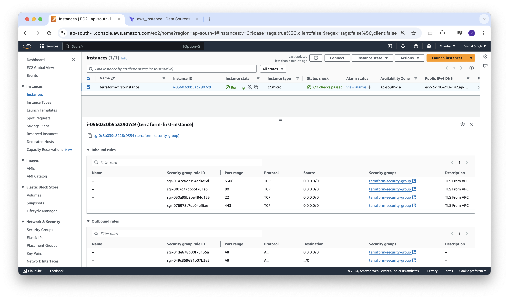
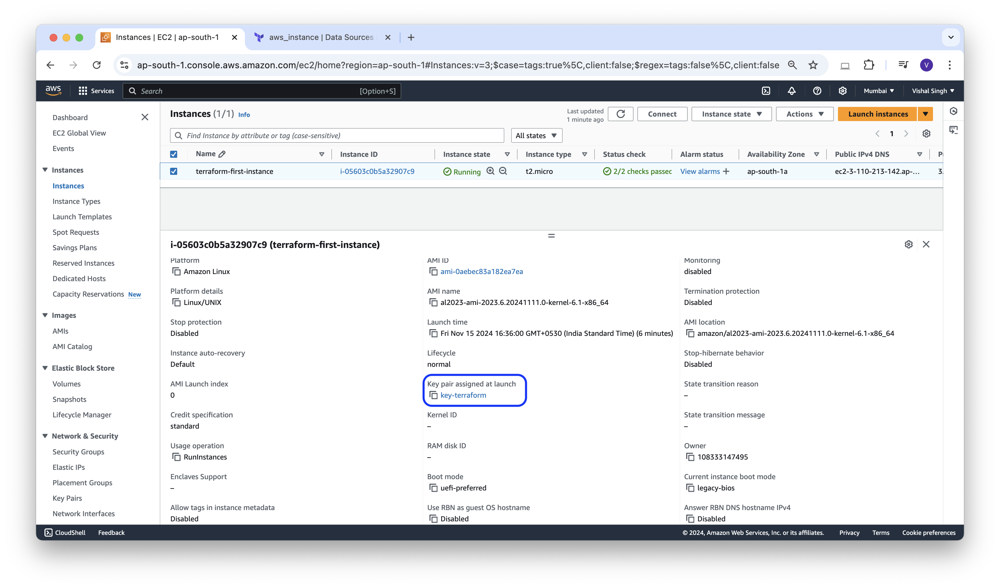

### Terraform Project Structure

In this blog, we going variablise the files that we created in previous blogs.

Let's modify the **provider.tf** with the below content.
```json
# Configure the AWS Provider
provider "aws" {
  region     = var.region
  access_key = var.access_key
  secret_key = var.secret_key
}
```


modify **instance.tf** with the below content.
```json
# Creating instance
resource "aws_instance" "terraform-first-instance" {
  ami                    = var.ami_id
  instance_type          = var.instance_type
  key_name               = aws_key_pair.key-terraform.key_name
  vpc_security_group_ids = ["${aws_security_group.terraform-security-group.id}"]
  tags = {
    Name = "terraform-first-instance"
  }
}
```

modify **aws-key.tf** with below content.
```json
# Creating ssh-key
resource "aws_key_pair" "key-terraform" {
  key_name   = "key-terraform"
  public_key = file("${path.module}/id_rsa.pub")
}
```

modify **aws-sg.tf** with below content
```json
# Creating Security Group
resource "aws_security_group" "terraform-security-group" {
  name        = "terraform-security-group"
  description = "Allow TLS inbound traffic and all outbound traffic"
  dynamic "ingress" {
    for_each = var.ports
    iterator = port
    content {
      description = "TLS From VPC"
      from_port   = port.value
      to_port     = port.value
      protocol    = "tcp"
      cidr_blocks = ["0.0.0.0/0"]
    }
  }
  egress {
    from_port        = 0
    to_port          = 0
    protocol         = "-1"
    cidr_blocks      = ["0.0.0.0/0"]
    ipv6_cidr_blocks = ["::/0"]
  }
  tags = {
    Name = "terraform-security-group"
  }
}
```


Create a new file **variable.tf** with the below content
```json
variable "ports" {
  type = list(number)
}
variable "region" {
  type = string
}
variable "instance_type" {
  type = string
}
variable "access_key" {
  type = string
}
variable "secret_key" {
  type = string
}
variable "ami_id" {
  type = string
}
```

now create a file **terraform.tfvars** file with the below contents.
```json
ports         = [22, 80, 443, 3306]
region        = "ap-south-1"
instance_type = "t2.micro"
access_key    = "your_access_key_here"
secret_key    = "your_secret_key_here"
ami_id        = "ami-0aebec83a182ea7ea"
```


**Outputs:**
```sh
vishalsingh@197NOMBT3987 14_aws-first-instance % terraform validate
Success! The configuration is valid.
```

```sh
vishalsingh@197NOMBT3987 14_aws-first-instance % terraform plan

Terraform used the selected providers to generate the following execution plan. Resource actions are indicated with the following symbols:
  + create

Terraform will perform the following actions:

  # aws_instance.terraform-first-instance will be created
  + resource "aws_instance" "terraform-first-instance" {
      + ami                                  = "ami-0aebec83a182ea7ea"
      + arn                                  = (known after apply)
      + associate_public_ip_address          = (known after apply)
      + availability_zone                    = (known after apply)
      + cpu_core_count                       = (known after apply)
      + cpu_threads_per_core                 = (known after apply)
      + disable_api_stop                     = (known after apply)
      + disable_api_termination              = (known after apply)
      + ebs_optimized                        = (known after apply)
      + get_password_data                    = false
      + host_id                              = (known after apply)
      + host_resource_group_arn              = (known after apply)
      + iam_instance_profile                 = (known after apply)
      + id                                   = (known after apply)
      + instance_initiated_shutdown_behavior = (known after apply)
      + instance_lifecycle                   = (known after apply)
      + instance_state                       = (known after apply)
      + instance_type                        = "t2.micro"
      + ipv6_address_count                   = (known after apply)
      + ipv6_addresses                       = (known after apply)
      + key_name                             = "key-terraform"
      + monitoring                           = (known after apply)
      + outpost_arn                          = (known after apply)
      + password_data                        = (known after apply)
      + placement_group                      = (known after apply)
      + placement_partition_number           = (known after apply)
      + primary_network_interface_id         = (known after apply)
      + private_dns                          = (known after apply)
      + private_ip                           = (known after apply)
      + public_dns                           = (known after apply)
      + public_ip                            = (known after apply)
      + secondary_private_ips                = (known after apply)
      + security_groups                      = (known after apply)
      + source_dest_check                    = true
      + spot_instance_request_id             = (known after apply)
      + subnet_id                            = (known after apply)
      + tags                                 = {
          + "Name" = "terraform-first-instance"
        }
      + tags_all                             = {
          + "Name" = "terraform-first-instance"
        }
      + tenancy                              = (known after apply)
      + user_data                            = (known after apply)
      + user_data_base64                     = (known after apply)
      + user_data_replace_on_change          = false
      + vpc_security_group_ids               = (known after apply)

      + capacity_reservation_specification (known after apply)

      + cpu_options (known after apply)

      + ebs_block_device (known after apply)

      + enclave_options (known after apply)

      + ephemeral_block_device (known after apply)

      + instance_market_options (known after apply)

      + maintenance_options (known after apply)

      + metadata_options (known after apply)

      + network_interface (known after apply)

      + private_dns_name_options (known after apply)

      + root_block_device (known after apply)
    }

  # aws_key_pair.key-terraform will be created
  + resource "aws_key_pair" "key-terraform" {
      + arn             = (known after apply)
      + fingerprint     = (known after apply)
      + id              = (known after apply)
      + key_name        = "key-terraform"
      + key_name_prefix = (known after apply)
      + key_pair_id     = (known after apply)
      + key_type        = (known after apply)
      + public_key      = "your_ssh_key_here"
      + tags_all        = (known after apply)
    }

  # aws_security_group.terraform-security-group will be created
  + resource "aws_security_group" "terraform-security-group" {
      + arn                    = (known after apply)
      + description            = "Allow TLS inbound traffic and all outbound traffic"
      + egress                 = [
          + {
              + cidr_blocks      = [
                  + "0.0.0.0/0",
                ]
              + from_port        = 0
              + ipv6_cidr_blocks = [
                  + "::/0",
                ]
              + prefix_list_ids  = []
              + protocol         = "-1"
              + security_groups  = []
              + self             = false
              + to_port          = 0
                # (1 unchanged attribute hidden)
            },
        ]
      + id                     = (known after apply)
      + ingress                = [
          + {
              + cidr_blocks      = [
                  + "0.0.0.0/0",
                ]
              + description      = "TLS From VPC"
              + from_port        = 22
              + ipv6_cidr_blocks = []
              + prefix_list_ids  = []
              + protocol         = "tcp"
              + security_groups  = []
              + self             = false
              + to_port          = 22
            },
          + {
              + cidr_blocks      = [
                  + "0.0.0.0/0",
                ]
              + description      = "TLS From VPC"
              + from_port        = 3306
              + ipv6_cidr_blocks = []
              + prefix_list_ids  = []
              + protocol         = "tcp"
              + security_groups  = []
              + self             = false
              + to_port          = 3306
            },
          + {
              + cidr_blocks      = [
                  + "0.0.0.0/0",
                ]
              + description      = "TLS From VPC"
              + from_port        = 443
              + ipv6_cidr_blocks = []
              + prefix_list_ids  = []
              + protocol         = "tcp"
              + security_groups  = []
              + self             = false
              + to_port          = 443
            },
          + {
              + cidr_blocks      = [
                  + "0.0.0.0/0",
                ]
              + description      = "TLS From VPC"
              + from_port        = 80
              + ipv6_cidr_blocks = []
              + prefix_list_ids  = []
              + protocol         = "tcp"
              + security_groups  = []
              + self             = false
              + to_port          = 80
            },
        ]
      + name                   = "terraform-security-group"
      + name_prefix            = (known after apply)
      + owner_id               = (known after apply)
      + revoke_rules_on_delete = false
      + tags                   = {
          + "Name" = "terraform-security-group"
        }
      + tags_all               = {
          + "Name" = "terraform-security-group"
        }
      + vpc_id                 = (known after apply)
    }

Plan: 3 to add, 0 to change, 0 to destroy.

─────────────────────────────────────────────────────────────────────────────────

Note: You didn't use the -out option to save this plan, so Terraform can't guarantee to take exactly these actions if you run "terraform apply" now.
```

```sh
vishalsingh@197NOMBT3987 14_aws-first-instance % terraform apply --auto-approve

Terraform used the selected providers to generate the following execution plan. Resource actions are indicated with the following symbols:
  + create

Terraform will perform the following actions:

  # aws_instance.terraform-first-instance will be created
  + resource "aws_instance" "terraform-first-instance" {
      + ami                                  = "ami-0aebec83a182ea7ea"
      + arn                                  = (known after apply)
      + associate_public_ip_address          = (known after apply)
      + availability_zone                    = (known after apply)
      + cpu_core_count                       = (known after apply)
      + cpu_threads_per_core                 = (known after apply)
      + disable_api_stop                     = (known after apply)
      + disable_api_termination              = (known after apply)
      + ebs_optimized                        = (known after apply)
      + get_password_data                    = false
      + host_id                              = (known after apply)
      + host_resource_group_arn              = (known after apply)
      + iam_instance_profile                 = (known after apply)
      + id                                   = (known after apply)
      + instance_initiated_shutdown_behavior = (known after apply)
      + instance_lifecycle                   = (known after apply)
      + instance_state                       = (known after apply)
      + instance_type                        = "t2.micro"
      + ipv6_address_count                   = (known after apply)
      + ipv6_addresses                       = (known after apply)
      + key_name                             = "key-terraform"
      + monitoring                           = (known after apply)
      + outpost_arn                          = (known after apply)
      + password_data                        = (known after apply)
      + placement_group                      = (known after apply)
      + placement_partition_number           = (known after apply)
      + primary_network_interface_id         = (known after apply)
      + private_dns                          = (known after apply)
      + private_ip                           = (known after apply)
      + public_dns                           = (known after apply)
      + public_ip                            = (known after apply)
      + secondary_private_ips                = (known after apply)
      + security_groups                      = (known after apply)
      + source_dest_check                    = true
      + spot_instance_request_id             = (known after apply)
      + subnet_id                            = (known after apply)
      + tags                                 = {
          + "Name" = "terraform-first-instance"
        }
      + tags_all                             = {
          + "Name" = "terraform-first-instance"
        }
      + tenancy                              = (known after apply)
      + user_data                            = (known after apply)
      + user_data_base64                     = (known after apply)
      + user_data_replace_on_change          = false
      + vpc_security_group_ids               = (known after apply)

      + capacity_reservation_specification (known after apply)

      + cpu_options (known after apply)

      + ebs_block_device (known after apply)

      + enclave_options (known after apply)

      + ephemeral_block_device (known after apply)

      + instance_market_options (known after apply)

      + maintenance_options (known after apply)

      + metadata_options (known after apply)

      + network_interface (known after apply)

      + private_dns_name_options (known after apply)

      + root_block_device (known after apply)
    }

  # aws_key_pair.key-terraform will be created
  + resource "aws_key_pair" "key-terraform" {
      + arn             = (known after apply)
      + fingerprint     = (known after apply)
      + id              = (known after apply)
      + key_name        = "key-terraform"
      + key_name_prefix = (known after apply)
      + key_pair_id     = (known after apply)
      + key_type        = (known after apply)
      + public_key      = "your_ssh_key_here"
      + tags_all        = (known after apply)
    }

  # aws_security_group.terraform-security-group will be created
  + resource "aws_security_group" "terraform-security-group" {
      + arn                    = (known after apply)
      + description            = "Allow TLS inbound traffic and all outbound traffic"
      + egress                 = [
          + {
              + cidr_blocks      = [
                  + "0.0.0.0/0",
                ]
              + from_port        = 0
              + ipv6_cidr_blocks = [
                  + "::/0",
                ]
              + prefix_list_ids  = []
              + protocol         = "-1"
              + security_groups  = []
              + self             = false
              + to_port          = 0
                # (1 unchanged attribute hidden)
            },
        ]
      + id                     = (known after apply)
      + ingress                = [
          + {
              + cidr_blocks      = [
                  + "0.0.0.0/0",
                ]
              + description      = "TLS From VPC"
              + from_port        = 22
              + ipv6_cidr_blocks = []
              + prefix_list_ids  = []
              + protocol         = "tcp"
              + security_groups  = []
              + self             = false
              + to_port          = 22
            },
          + {
              + cidr_blocks      = [
                  + "0.0.0.0/0",
                ]
              + description      = "TLS From VPC"
              + from_port        = 3306
              + ipv6_cidr_blocks = []
              + prefix_list_ids  = []
              + protocol         = "tcp"
              + security_groups  = []
              + self             = false
              + to_port          = 3306
            },
          + {
              + cidr_blocks      = [
                  + "0.0.0.0/0",
                ]
              + description      = "TLS From VPC"
              + from_port        = 443
              + ipv6_cidr_blocks = []
              + prefix_list_ids  = []
              + protocol         = "tcp"
              + security_groups  = []
              + self             = false
              + to_port          = 443
            },
          + {
              + cidr_blocks      = [
                  + "0.0.0.0/0",
                ]
              + description      = "TLS From VPC"
              + from_port        = 80
              + ipv6_cidr_blocks = []
              + prefix_list_ids  = []
              + protocol         = "tcp"
              + security_groups  = []
              + self             = false
              + to_port          = 80
            },
        ]
      + name                   = "terraform-security-group"
      + name_prefix            = (known after apply)
      + owner_id               = (known after apply)
      + revoke_rules_on_delete = false
      + tags                   = {
          + "Name" = "terraform-security-group"
        }
      + tags_all               = {
          + "Name" = "terraform-security-group"
        }
      + vpc_id                 = (known after apply)
    }

Plan: 3 to add, 0 to change, 0 to destroy.
aws_key_pair.key-terraform: Creating...
aws_security_group.terraform-security-group: Creating...
aws_key_pair.key-terraform: Creation complete after 0s [id=key-terraform]
aws_security_group.terraform-security-group: Creation complete after 3s [id=sg-0298faf2aae86b733]
aws_instance.terraform-first-instance: Creating...
aws_instance.terraform-first-instance: Still creating... [10s elapsed]
aws_instance.terraform-first-instance: Still creating... [20s elapsed]
aws_instance.terraform-first-instance: Still creating... [30s elapsed]
aws_instance.terraform-first-instance: Creation complete after 32s [id=i-0c09298fd9679be43]

Apply complete! Resources: 3 added, 0 changed, 0 destroyed.

```






**Connecting Instance using SSH:**

```sh
vishalsingh@197NOMBT3987 Terraform % cd 14_aws-first-instance 
vishalsingh@197NOMBT3987 14_aws-first-instance % ssh -i id_rsa ec2-user@3.110.213.142 
The authenticity of host '3.110.213.142 (3.110.213.142)' can't be established.
ED25519 key fingerprint is SHA256:kyp+cPu7U6115zl3+wzq4r/h89MTYCjELrDen+1Qvqc.
This key is not known by any other names.
Are you sure you want to continue connecting (yes/no/[fingerprint])? yes
Warning: Permanently added '3.110.213.142' (ED25519) to the list of known hosts.
   ,     #_
   ~\_  ####_        Amazon Linux 2023
  ~~  \_#####\
  ~~     \###|
  ~~       \#/ ___   https://aws.amazon.com/linux/amazon-linux-2023
   ~~       V~' '->
    ~~~         /
      ~~._.   _/
         _/ _/
       _/m/'
[ec2-user@ip-172-31-36-52 ~]$ ls
[ec2-user@ip-172-31-36-52 ~]$ whoami
ec2-user
[ec2-user@ip-172-31-36-52 ~]$ ping google.com
PING google.com (142.251.42.14) 56(84) bytes of data.
64 bytes from bom12s19-in-f14.1e100.net (142.251.42.14): icmp_seq=1 ttl=54 time=1.73 ms
64 bytes from bom12s19-in-f14.1e100.net (142.251.42.14): icmp_seq=2 ttl=54 time=1.90 ms
64 bytes from bom12s19-in-f14.1e100.net (142.251.42.14): icmp_seq=3 ttl=54 time=1.84 ms
64 bytes from bom12s19-in-f14.1e100.net (142.251.42.14): icmp_seq=4 ttl=54 time=1.75 ms
64 bytes from bom12s19-in-f14.1e100.net (142.251.42.14): icmp_seq=5 ttl=54 time=1.76 ms
64 bytes from bom12s19-in-f14.1e100.net (142.251.42.14): icmp_seq=6 ttl=54 time=1.70 ms
64 bytes from bom12s19-in-f14.1e100.net (142.251.42.14): icmp_seq=7 ttl=54 time=1.78 ms
^C
--- google.com ping statistics ---
7 packets transmitted, 7 received, 0% packet loss, time 6010ms
rtt min/avg/max/mdev = 1.701/1.779/1.899/0.063 ms
```

**Destroy:**
```sh
vishalsingh@197NOMBT3987 14_aws-first-instance % terraform destroy
aws_key_pair.key-terraform: Refreshing state... [id=key-terraform]
aws_security_group.terraform-security-group: Refreshing state... [id=sg-0298faf2aae86b733]
aws_instance.terraform-first-instance: Refreshing state... [id=i-0c09298fd9679be43]

Terraform used the selected providers to generate the following execution plan. Resource actions are indicated with the following symbols:
  - destroy

Terraform will perform the following actions:

  # aws_instance.terraform-first-instance will be destroyed
  - resource "aws_instance" "terraform-first-instance" {
      - ami                                  = "ami-0aebec83a182ea7ea" -> null
      - arn                                  = "arn:aws:ec2:ap-south-1:108333147495:instance/i-0c09298fd9679be43" -> null
      - associate_public_ip_address          = true -> null
      - availability_zone                    = "ap-south-1a" -> null
      - cpu_core_count                       = 1 -> null
      - cpu_threads_per_core                 = 1 -> null
      - disable_api_stop                     = false -> null
      - disable_api_termination              = false -> null
      - ebs_optimized                        = false -> null
      - get_password_data                    = false -> null
      - hibernation                          = false -> null
      - id                                   = "i-0c09298fd9679be43" -> null
      - instance_initiated_shutdown_behavior = "stop" -> null
      - instance_state                       = "running" -> null
      - instance_type                        = "t2.micro" -> null
      - ipv6_address_count                   = 0 -> null
      - ipv6_addresses                       = [] -> null
      - key_name                             = "key-terraform" -> null
      - monitoring                           = false -> null
      - placement_partition_number           = 0 -> null
      - primary_network_interface_id         = "eni-079f12f96089c7572" -> null
      - private_dns                          = "ip-172-31-36-100.ap-south-1.compute.internal" -> null
      - private_ip                           = "172.31.36.100" -> null
      - public_dns                           = "ec2-52-66-14-69.ap-south-1.compute.amazonaws.com" -> null
      - public_ip                            = "52.66.14.69" -> null
      - secondary_private_ips                = [] -> null
      - security_groups                      = [
          - "terraform-security-group",
        ] -> null
      - source_dest_check                    = true -> null
      - subnet_id                            = "subnet-0b614459ff3b519e1" -> null
      - tags                                 = {
          - "Name" = "terraform-first-instance"
        } -> null
      - tags_all                             = {
          - "Name" = "terraform-first-instance"
        } -> null
      - tenancy                              = "default" -> null
      - user_data_replace_on_change          = false -> null
      - vpc_security_group_ids               = [
          - "sg-0298faf2aae86b733",
        ] -> null
        # (7 unchanged attributes hidden)

      - capacity_reservation_specification {
          - capacity_reservation_preference = "open" -> null
        }

      - cpu_options {
          - core_count       = 1 -> null
          - threads_per_core = 1 -> null
            # (1 unchanged attribute hidden)
        }

      - credit_specification {
          - cpu_credits = "standard" -> null
        }

      - enclave_options {
          - enabled = false -> null
        }

      - maintenance_options {
          - auto_recovery = "default" -> null
        }

      - metadata_options {
          - http_endpoint               = "enabled" -> null
          - http_protocol_ipv6          = "disabled" -> null
          - http_put_response_hop_limit = 2 -> null
          - http_tokens                 = "required" -> null
          - instance_metadata_tags      = "disabled" -> null
        }

      - private_dns_name_options {
          - enable_resource_name_dns_a_record    = false -> null
          - enable_resource_name_dns_aaaa_record = false -> null
          - hostname_type                        = "ip-name" -> null
        }

      - root_block_device {
          - delete_on_termination = true -> null
          - device_name           = "/dev/xvda" -> null
          - encrypted             = false -> null
          - iops                  = 3000 -> null
          - tags                  = {} -> null
          - tags_all              = {} -> null
          - throughput            = 125 -> null
          - volume_id             = "vol-0583e746caa0be5ca" -> null
          - volume_size           = 8 -> null
          - volume_type           = "gp3" -> null
            # (1 unchanged attribute hidden)
        }
    }

  # aws_key_pair.key-terraform will be destroyed
  - resource "aws_key_pair" "key-terraform" {
      - arn             = "arn:aws:ec2:ap-south-1:108333147495:key-pair/key-terraform" -> null
      - fingerprint     = "0a:2d:27:d1:a7:6a:f1:cb:83:9b:f4:df:a2:8e:49:3e" -> null
      - id              = "key-terraform" -> null
      - key_name        = "key-terraform" -> null
      - key_pair_id     = "key-0f26793a96ccaedfe" -> null
      - key_type        = "rsa" -> null
      - public_key      = "your_ssh_key_here" -> null
      - tags            = {} -> null
      - tags_all        = {} -> null
        # (1 unchanged attribute hidden)
    }

  # aws_security_group.terraform-security-group will be destroyed
  - resource "aws_security_group" "terraform-security-group" {
      - arn                    = "arn:aws:ec2:ap-south-1:108333147495:security-group/sg-0298faf2aae86b733" -> null
      - description            = "Allow TLS inbound traffic and all outbound traffic" -> null
      - egress                 = [
          - {
              - cidr_blocks      = [
                  - "0.0.0.0/0",
                ]
              - from_port        = 0
              - ipv6_cidr_blocks = [
                  - "::/0",
                ]
              - prefix_list_ids  = []
              - protocol         = "-1"
              - security_groups  = []
              - self             = false
              - to_port          = 0
                # (1 unchanged attribute hidden)
            },
        ] -> null
      - id                     = "sg-0298faf2aae86b733" -> null
      - ingress                = [
          - {
              - cidr_blocks      = [
                  - "0.0.0.0/0",
                ]
              - description      = "TLS From VPC"
              - from_port        = 22
              - ipv6_cidr_blocks = []
              - prefix_list_ids  = []
              - protocol         = "tcp"
              - security_groups  = []
              - self             = false
              - to_port          = 22
            },
          - {
              - cidr_blocks      = [
                  - "0.0.0.0/0",
                ]
              - description      = "TLS From VPC"
              - from_port        = 3306
              - ipv6_cidr_blocks = []
              - prefix_list_ids  = []
              - protocol         = "tcp"
              - security_groups  = []
              - self             = false
              - to_port          = 3306
            },
          - {
              - cidr_blocks      = [
                  - "0.0.0.0/0",
                ]
              - description      = "TLS From VPC"
              - from_port        = 443
              - ipv6_cidr_blocks = []
              - prefix_list_ids  = []
              - protocol         = "tcp"
              - security_groups  = []
              - self             = false
              - to_port          = 443
            },
          - {
              - cidr_blocks      = [
                  - "0.0.0.0/0",
                ]
              - description      = "TLS From VPC"
              - from_port        = 80
              - ipv6_cidr_blocks = []
              - prefix_list_ids  = []
              - protocol         = "tcp"
              - security_groups  = []
              - self             = false
              - to_port          = 80
            },
        ] -> null
      - name                   = "terraform-security-group" -> null
      - owner_id               = "108333147495" -> null
      - revoke_rules_on_delete = false -> null
      - tags                   = {
          - "Name" = "terraform-security-group"
        } -> null
      - tags_all               = {
          - "Name" = "terraform-security-group"
        } -> null
      - vpc_id                 = "vpc-06e66f832773e7e7f" -> null
        # (1 unchanged attribute hidden)
    }

Plan: 0 to add, 0 to change, 3 to destroy.

Do you really want to destroy all resources?
  Terraform will destroy all your managed infrastructure, as shown above.
  There is no undo. Only 'yes' will be accepted to confirm.

  Enter a value: yes

aws_instance.terraform-first-instance: Destroying... [id=i-0c09298fd9679be43]
aws_instance.terraform-first-instance: Still destroying... [id=i-0c09298fd9679be43, 10s elapsed]
aws_instance.terraform-first-instance: Still destroying... [id=i-0c09298fd9679be43, 20s elapsed]
aws_instance.terraform-first-instance: Still destroying... [id=i-0c09298fd9679be43, 30s elapsed]
aws_instance.terraform-first-instance: Still destroying... [id=i-0c09298fd9679be43, 40s elapsed]
aws_instance.terraform-first-instance: Destruction complete after 40s
aws_key_pair.key-terraform: Destroying... [id=key-terraform]
aws_security_group.terraform-security-group: Destroying... [id=sg-0298faf2aae86b733]
aws_key_pair.key-terraform: Destruction complete after 0s
aws_security_group.terraform-security-group: Destruction complete after 1s

Destroy complete! Resources: 3 destro

