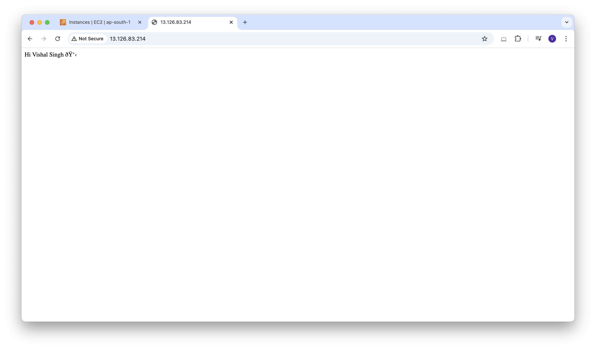
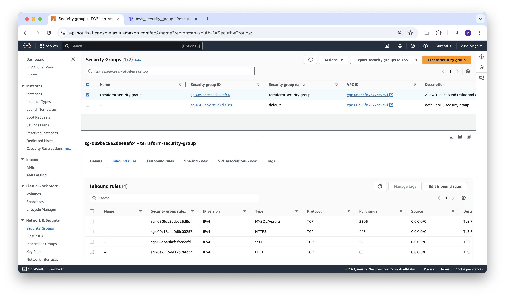

### AWS User Data Using Terraform

AWS **user data** is the set of commands/data you can provide to a instance at launch time. For example if you are launching an ec2 instance and want to have docker installed on the newly launched ec2, than you can provide set of bash commands in the user data field of aws ec2 config page.

In this blog, we are going to assign user-data to AWS instance with the help of terraform.

lets create a file named **script.sh** with the below content.
```sh
#!/bin/bash
sudo apt-get update
sudo apt-get install nginx -y
sudo echo "Hi Vishal Singh 👋 " >/var/www/html/index.nginx-debian.html
```


now modify **instance.tf** file with the below content, so we can use this script as user data.
```json
# Creating instance
resource "aws_instance" "terraform-first-instance" {
  ami                    = var.ami_id
  instance_type          = var.instance_type
  key_name               = aws_key_pair.key-terraform.key_name
  vpc_security_group_ids = ["${aws_security_group.terraform-security-group.id}"]
  tags = {
    Name = "terraform-first-instance"
  }
  user_data = file("${path.module}/script.sh")
}
```

now we can run terraform apply command and verify that the instance created and Nginx is also installed in that instance with the help of userdata. you can access it on port 80 by default.

```sh
vishalsingh@197NOMBT3987 14_aws-first-instance % terraform validate
Success! The configuration is valid.
```

```sh
vishalsingh@197NOMBT3987 14_aws-first-instance % terraform plan

Terraform used the selected providers to generate the following execution plan. Resource actions are indicated with the following symbols:
  + create

Terraform will perform the following actions:

  # aws_instance.terraform-first-instance will be created
  + resource "aws_instance" "terraform-first-instance" {
      + ami                                  = "ami-0aebec83a182ea7ea"
      + arn                                  = (known after apply)
      + associate_public_ip_address          = (known after apply)
      + availability_zone                    = (known after apply)
      + cpu_core_count                       = (known after apply)
      + cpu_threads_per_core                 = (known after apply)
      + disable_api_stop                     = (known after apply)
      + disable_api_termination              = (known after apply)
      + ebs_optimized                        = (known after apply)
      + get_password_data                    = false
      + host_id                              = (known after apply)
      + host_resource_group_arn              = (known after apply)
      + iam_instance_profile                 = (known after apply)
      + id                                   = (known after apply)
      + instance_initiated_shutdown_behavior = (known after apply)
      + instance_lifecycle                   = (known after apply)
      + instance_state                       = (known after apply)
      + instance_type                        = "t2.micro"
      + ipv6_address_count                   = (known after apply)
      + ipv6_addresses                       = (known after apply)
      + key_name                             = "key-terraform"
      + monitoring                           = (known after apply)
      + outpost_arn                          = (known after apply)
      + password_data                        = (known after apply)
      + placement_group                      = (known after apply)
      + placement_partition_number           = (known after apply)
      + primary_network_interface_id         = (known after apply)
      + private_dns                          = (known after apply)
      + private_ip                           = (known after apply)
      + public_dns                           = (known after apply)
      + public_ip                            = (known after apply)
      + secondary_private_ips                = (known after apply)
      + security_groups                      = (known after apply)
      + source_dest_check                    = true
      + spot_instance_request_id             = (known after apply)
      + subnet_id                            = (known after apply)
      + tags                                 = {
          + "Name" = "terraform-first-instance"
        }
      + tags_all                             = {
          + "Name" = "terraform-first-instance"
        }
      + tenancy                              = (known after apply)
      + user_data                            = "b72107ba540c5f8287292f93611feb469d1119bb"
      + user_data_base64                     = (known after apply)
      + user_data_replace_on_change          = false
      + vpc_security_group_ids               = (known after apply)

      + capacity_reservation_specification (known after apply)

      + cpu_options (known after apply)

      + ebs_block_device (known after apply)

      + enclave_options (known after apply)

      + ephemeral_block_device (known after apply)

      + instance_market_options (known after apply)

      + maintenance_options (known after apply)

      + metadata_options (known after apply)

      + network_interface (known after apply)

      + private_dns_name_options (known after apply)

      + root_block_device (known after apply)
    }

  # aws_key_pair.key-terraform will be created
  + resource "aws_key_pair" "key-terraform" {
      + arn             = (known after apply)
      + fingerprint     = (known after apply)
      + id              = (known after apply)
      + key_name        = "key-terraform"
      + key_name_prefix = (known after apply)
      + key_pair_id     = (known after apply)
      + key_type        = (known after apply)
      + public_key      = "your_ssh_key_here"
      + tags_all        = (known after apply)
    }

  # aws_security_group.terraform-security-group will be created
  + resource "aws_security_group" "terraform-security-group" {
      + arn                    = (known after apply)
      + description            = "Allow TLS inbound traffic and all outbound traffic"
      + egress                 = [
          + {
              + cidr_blocks      = [
                  + "0.0.0.0/0",
                ]
              + from_port        = 0
              + ipv6_cidr_blocks = [
                  + "::/0",
                ]
              + prefix_list_ids  = []
              + protocol         = "-1"
              + security_groups  = []
              + self             = false
              + to_port          = 0
                # (1 unchanged attribute hidden)
            },
        ]
      + id                     = (known after apply)
      + ingress                = [
          + {
              + cidr_blocks      = [
                  + "0.0.0.0/0",
                ]
              + description      = "TLS From VPC"
              + from_port        = 22
              + ipv6_cidr_blocks = []
              + prefix_list_ids  = []
              + protocol         = "tcp"
              + security_groups  = []
              + self             = false
              + to_port          = 22
            },
          + {
              + cidr_blocks      = [
                  + "0.0.0.0/0",
                ]
              + description      = "TLS From VPC"
              + from_port        = 3306
              + ipv6_cidr_blocks = []
              + prefix_list_ids  = []
              + protocol         = "tcp"
              + security_groups  = []
              + self             = false
              + to_port          = 3306
            },
          + {
              + cidr_blocks      = [
                  + "0.0.0.0/0",
                ]
              + description      = "TLS From VPC"
              + from_port        = 443
              + ipv6_cidr_blocks = []
              + prefix_list_ids  = []
              + protocol         = "tcp"
              + security_groups  = []
              + self             = false
              + to_port          = 443
            },
          + {
              + cidr_blocks      = [
                  + "0.0.0.0/0",
                ]
              + description      = "TLS From VPC"
              + from_port        = 80
              + ipv6_cidr_blocks = []
              + prefix_list_ids  = []
              + protocol         = "tcp"
              + security_groups  = []
              + self             = false
              + to_port          = 80
            },
        ]
      + name                   = "terraform-security-group"
      + name_prefix            = (known after apply)
      + owner_id               = (known after apply)
      + revoke_rules_on_delete = false
      + tags                   = {
          + "Name" = "terraform-security-group"
        }
      + tags_all               = {
          + "Name" = "terraform-security-group"
        }
      + vpc_id                 = (known after apply)
    }

Plan: 3 to add, 0 to change, 0 to destroy.

─────────────────────────────────────────────────────────────────────────────────

Note: You didn't use the -out option to save this plan, so Terraform can't guarantee to take exactly these actions if you run "terraform apply" now.
```

```sh
vishalsingh@197NOMBT3987 14_aws-first-instance % terraform apply --auto-approve

Terraform used the selected providers to generate the following execution plan. Resource actions are indicated with the following symbols:
  + create

Terraform will perform the following actions:

  # aws_instance.terraform-first-instance will be created
  + resource "aws_instance" "terraform-first-instance" {
      + ami                                  = "ami-0aebec83a182ea7ea"
      + arn                                  = (known after apply)
      + associate_public_ip_address          = (known after apply)
      + availability_zone                    = (known after apply)
      + cpu_core_count                       = (known after apply)
      + cpu_threads_per_core                 = (known after apply)
      + disable_api_stop                     = (known after apply)
      + disable_api_termination              = (known after apply)
      + ebs_optimized                        = (known after apply)
      + get_password_data                    = false
      + host_id                              = (known after apply)
      + host_resource_group_arn              = (known after apply)
      + iam_instance_profile                 = (known after apply)
      + id                                   = (known after apply)
      + instance_initiated_shutdown_behavior = (known after apply)
      + instance_lifecycle                   = (known after apply)
      + instance_state                       = (known after apply)
      + instance_type                        = "t2.micro"
      + ipv6_address_count                   = (known after apply)
      + ipv6_addresses                       = (known after apply)
      + key_name                             = "key-terraform"
      + monitoring                           = (known after apply)
      + outpost_arn                          = (known after apply)
      + password_data                        = (known after apply)
      + placement_group                      = (known after apply)
      + placement_partition_number           = (known after apply)
      + primary_network_interface_id         = (known after apply)
      + private_dns                          = (known after apply)
      + private_ip                           = (known after apply)
      + public_dns                           = (known after apply)
      + public_ip                            = (known after apply)
      + secondary_private_ips                = (known after apply)
      + security_groups                      = (known after apply)
      + source_dest_check                    = true
      + spot_instance_request_id             = (known after apply)
      + subnet_id                            = (known after apply)
      + tags                                 = {
          + "Name" = "terraform-first-instance"
        }
      + tags_all                             = {
          + "Name" = "terraform-first-instance"
        }
      + tenancy                              = (known after apply)
      + user_data                            = "b72107ba540c5f8287292f93611feb469d1119bb"
      + user_data_base64                     = (known after apply)
      + user_data_replace_on_change          = false
      + vpc_security_group_ids               = (known after apply)

      + capacity_reservation_specification (known after apply)

      + cpu_options (known after apply)

      + ebs_block_device (known after apply)

      + enclave_options (known after apply)

      + ephemeral_block_device (known after apply)

      + instance_market_options (known after apply)

      + maintenance_options (known after apply)

      + metadata_options (known after apply)

      + network_interface (known after apply)

      + private_dns_name_options (known after apply)

      + root_block_device (known after apply)
    }

  # aws_key_pair.key-terraform will be created
  + resource "aws_key_pair" "key-terraform" {
      + arn             = (known after apply)
      + fingerprint     = (known after apply)
      + id              = (known after apply)
      + key_name        = "key-terraform"
      + key_name_prefix = (known after apply)
      + key_pair_id     = (known after apply)
      + key_type        = (known after apply)
      + public_key      = "your_ssh_key_here"
      + tags_all        = (known after apply)
    }

  # aws_security_group.terraform-security-group will be created
  + resource "aws_security_group" "terraform-security-group" {
      + arn                    = (known after apply)
      + description            = "Allow TLS inbound traffic and all outbound traffic"
      + egress                 = [
          + {
              + cidr_blocks      = [
                  + "0.0.0.0/0",
                ]
              + from_port        = 0
              + ipv6_cidr_blocks = [
                  + "::/0",
                ]
              + prefix_list_ids  = []
              + protocol         = "-1"
              + security_groups  = []
              + self             = false
              + to_port          = 0
                # (1 unchanged attribute hidden)
            },
        ]
      + id                     = (known after apply)
      + ingress                = [
          + {
              + cidr_blocks      = [
                  + "0.0.0.0/0",
                ]
              + description      = "TLS From VPC"
              + from_port        = 22
              + ipv6_cidr_blocks = []
              + prefix_list_ids  = []
              + protocol         = "tcp"
              + security_groups  = []
              + self             = false
              + to_port          = 22
            },
          + {
              + cidr_blocks      = [
                  + "0.0.0.0/0",
                ]
              + description      = "TLS From VPC"
              + from_port        = 3306
              + ipv6_cidr_blocks = []
              + prefix_list_ids  = []
              + protocol         = "tcp"
              + security_groups  = []
              + self             = false
              + to_port          = 3306
            },
          + {
              + cidr_blocks      = [
                  + "0.0.0.0/0",
                ]
              + description      = "TLS From VPC"
              + from_port        = 443
              + ipv6_cidr_blocks = []
              + prefix_list_ids  = []
              + protocol         = "tcp"
              + security_groups  = []
              + self             = false
              + to_port          = 443
            },
          + {
              + cidr_blocks      = [
                  + "0.0.0.0/0",
                ]
              + description      = "TLS From VPC"
              + from_port        = 80
              + ipv6_cidr_blocks = []
              + prefix_list_ids  = []
              + protocol         = "tcp"
              + security_groups  = []
              + self             = false
              + to_port          = 80
            },
        ]
      + name                   = "terraform-security-group"
      + name_prefix            = (known after apply)
      + owner_id               = (known after apply)
      + revoke_rules_on_delete = false
      + tags                   = {
          + "Name" = "terraform-security-group"
        }
      + tags_all               = {
          + "Name" = "terraform-security-group"
        }
      + vpc_id                 = (known after apply)
    }

Plan: 3 to add, 0 to change, 0 to destroy.
aws_key_pair.key-terraform: Creating...
aws_security_group.terraform-security-group: Creating...
aws_key_pair.key-terraform: Creation complete after 2s [id=key-terraform]
aws_security_group.terraform-security-group: Creation complete after 4s [id=sg-07448bd8ee28ee684]
aws_instance.terraform-first-instance: Creating...
aws_instance.terraform-first-instance: Still creating... [10s elapsed]
aws_instance.terraform-first-instance: Still creating... [20s elapsed]
aws_instance.terraform-first-instance: Still creating... [30s elapsed]
aws_instance.terraform-first-instance: Creation complete after 32s [id=i-0e9e3399e4449452f]

Apply complete! Resources: 3 added, 0 changed, 0 destroyed.
```



**Destroy:**
```sh
vishalsingh@197NOMBT3987 14_aws-first-instance % terraform destroy
aws_key_pair.key-terraform: Refreshing state... [id=key-terraform]
aws_security_group.terraform-security-group: Refreshing state... [id=sg-07448bd8ee28ee684]
aws_instance.terraform-first-instance: Refreshing state... [id=i-0e3f8beddc05b89fb]

Terraform used the selected providers to generate the following execution plan. Resource actions are indicated with the following symbols:
  - destroy

Terraform will perform the following actions:

  # aws_instance.terraform-first-instance will be destroyed
  - resource "aws_instance" "terraform-first-instance" {
      - ami                                  = "ami-0dee22c13ea7a9a67" -> null
      - arn                                  = "arn:aws:ec2:ap-south-1:108333147495:instance/i-0e3f8beddc05b89fb" -> null
      - associate_public_ip_address          = true -> null
      - availability_zone                    = "ap-south-1a" -> null
      - cpu_core_count                       = 1 -> null
      - cpu_threads_per_core                 = 1 -> null
      - disable_api_stop                     = false -> null
      - disable_api_termination              = false -> null
      - ebs_optimized                        = false -> null
      - get_password_data                    = false -> null
      - hibernation                          = false -> null
      - id                                   = "i-0e3f8beddc05b89fb" -> null
      - instance_initiated_shutdown_behavior = "stop" -> null
      - instance_state                       = "running" -> null
      - instance_type                        = "t2.micro" -> null
      - ipv6_address_count                   = 0 -> null
      - ipv6_addresses                       = [] -> null
      - key_name                             = "key-terraform" -> null
      - monitoring                           = false -> null
      - placement_partition_number           = 0 -> null
      - primary_network_interface_id         = "eni-0828171855ff4268f" -> null
      - private_dns                          = "ip-172-31-33-164.ap-south-1.compute.internal" -> null
      - private_ip                           = "172.31.33.164" -> null
      - public_dns                           = "ec2-13-126-83-214.ap-south-1.compute.amazonaws.com" -> null
      - public_ip                            = "13.126.83.214" -> null
      - secondary_private_ips                = [] -> null
      - security_groups                      = [
          - "terraform-security-group",
        ] -> null
      - source_dest_check                    = true -> null
      - subnet_id                            = "subnet-0b614459ff3b519e1" -> null
      - tags                                 = {
          - "Name" = "terraform-first-instance"
        } -> null
      - tags_all                             = {
          - "Name" = "terraform-first-instance"
        } -> null
      - tenancy                              = "default" -> null
      - user_data                            = "b72107ba540c5f8287292f93611feb469d1119bb" -> null
      - user_data_replace_on_change          = false -> null
      - vpc_security_group_ids               = [
          - "sg-07448bd8ee28ee684",
        ] -> null
        # (7 unchanged attributes hidden)

      - capacity_reservation_specification {
          - capacity_reservation_preference = "open" -> null
        }

      - cpu_options {
          - core_count       = 1 -> null
          - threads_per_core = 1 -> null
            # (1 unchanged attribute hidden)
        }

      - credit_specification {
          - cpu_credits = "standard" -> null
        }

      - enclave_options {
          - enabled = false -> null
        }

      - maintenance_options {
          - auto_recovery = "default" -> null
        }

      - metadata_options {
          - http_endpoint               = "enabled" -> null
          - http_protocol_ipv6          = "disabled" -> null
          - http_put_response_hop_limit = 2 -> null
          - http_tokens                 = "required" -> null
          - instance_metadata_tags      = "disabled" -> null
        }

      - private_dns_name_options {
          - enable_resource_name_dns_a_record    = false -> null
          - enable_resource_name_dns_aaaa_record = false -> null
          - hostname_type                        = "ip-name" -> null
        }

      - root_block_device {
          - delete_on_termination = true -> null
          - device_name           = "/dev/sda1" -> null
          - encrypted             = false -> null
          - iops                  = 3000 -> null
          - tags                  = {} -> null
          - tags_all              = {} -> null
          - throughput            = 125 -> null
          - volume_id             = "vol-0ee06f5d203d7e57f" -> null
          - volume_size           = 8 -> null
          - volume_type           = "gp3" -> null
            # (1 unchanged attribute hidden)
        }
    }

  # aws_key_pair.key-terraform will be destroyed
  - resource "aws_key_pair" "key-terraform" {
      - arn             = "arn:aws:ec2:ap-south-1:108333147495:key-pair/key-terraform" -> null
      - fingerprint     = "0a:2d:27:d1:a7:6a:f1:cb:83:9b:f4:df:a2:8e:49:3e" -> null
      - id              = "key-terraform" -> null
      - key_name        = "key-terraform" -> null
      - key_pair_id     = "key-09dcb20ce521a9d5e" -> null
      - key_type        = "rsa" -> null
      - public_key      = "your_ssh_key_here" -> null
      - tags            = {} -> null
      - tags_all        = {} -> null
        # (1 unchanged attribute hidden)
    }

  # aws_security_group.terraform-security-group will be destroyed
  - resource "aws_security_group" "terraform-security-group" {
      - arn                    = "arn:aws:ec2:ap-south-1:108333147495:security-group/sg-07448bd8ee28ee684" -> null
      - description            = "Allow TLS inbound traffic and all outbound traffic" -> null
      - egress                 = [
          - {
              - cidr_blocks      = [
                  - "0.0.0.0/0",
                ]
              - from_port        = 0
              - ipv6_cidr_blocks = [
                  - "::/0",
                ]
              - prefix_list_ids  = []
              - protocol         = "-1"
              - security_groups  = []
              - self             = false
              - to_port          = 0
                # (1 unchanged attribute hidden)
            },
        ] -> null
      - id                     = "sg-07448bd8ee28ee684" -> null
      - ingress                = [
          - {
              - cidr_blocks      = [
                  - "0.0.0.0/0",
                ]
              - description      = "TLS From VPC"
              - from_port        = 22
              - ipv6_cidr_blocks = []
              - prefix_list_ids  = []
              - protocol         = "tcp"
              - security_groups  = []
              - self             = false
              - to_port          = 22
            },
          - {
              - cidr_blocks      = [
                  - "0.0.0.0/0",
                ]
              - description      = "TLS From VPC"
              - from_port        = 3306
              - ipv6_cidr_blocks = []
              - prefix_list_ids  = []
              - protocol         = "tcp"
              - security_groups  = []
              - self             = false
              - to_port          = 3306
            },
          - {
              - cidr_blocks      = [
                  - "0.0.0.0/0",
                ]
              - description      = "TLS From VPC"
              - from_port        = 443
              - ipv6_cidr_blocks = []
              - prefix_list_ids  = []
              - protocol         = "tcp"
              - security_groups  = []
              - self             = false
              - to_port          = 443
            },
          - {
              - cidr_blocks      = [
                  - "0.0.0.0/0",
                ]
              - description      = "TLS From VPC"
              - from_port        = 80
              - ipv6_cidr_blocks = []
              - prefix_list_ids  = []
              - protocol         = "tcp"
              - security_groups  = []
              - self             = false
              - to_port          = 80
            },
        ] -> null
      - name                   = "terraform-security-group" -> null
      - owner_id               = "108333147495" -> null
      - revoke_rules_on_delete = false -> null
      - tags                   = {
          - "Name" = "terraform-security-group"
        } -> null
      - tags_all               = {
          - "Name" = "terraform-security-group"
        } -> null
      - vpc_id                 = "vpc-06e66f832773e7e7f" -> null
        # (1 unchanged attribute hidden)
    }

Plan: 0 to add, 0 to change, 3 to destroy.

Do you really want to destroy all resources?
  Terraform will destroy all your managed infrastructure, as shown above.
  There is no undo. Only 'yes' will be accepted to confirm.

  Enter a value: yes

aws_instance.terraform-first-instance: Destroying... [id=i-0e3f8beddc05b89fb]
aws_instance.terraform-first-instance: Still destroying... [id=i-0e3f8beddc05b89fb, 10s elapsed]
aws_instance.terraform-first-instance: Still destroying... [id=i-0e3f8beddc05b89fb, 20s elapsed]
aws_instance.terraform-first-instance: Still destroying... [id=i-0e3f8beddc05b89fb, 30s elapsed]
aws_instance.terraform-first-instance: Still destroying... [id=i-0e3f8beddc05b89fb, 40s elapsed]
aws_instance.terraform-first-instance: Destruction complete after 40s
aws_key_pair.key-terraform: Destroying... [id=key-terraform]
aws_security_group.terraform-security-group: Destroying... [id=sg-07448bd8ee28ee684]
aws_key_pair.key-terraform: Destruction complete after 1s
aws_security_group.terraform-security-group: Destruction complete after 1s

Destroy complete! Resources: 3 destroyed.

```



Let's destroy first the already create infrastructure using the terraform destroy command and then again run terraform apply command you can verify that an instance, security group, and ssh key pair are created and the key-pair and security group attached to that instance.

```sh
vishalsingh@197NOMBT3987 14_aws-first-instance % terraform destroy
aws_security_group.terraform-security-group: Refreshing state... [id=sg-089b6c6e2dae9efc4]

Terraform used the selected providers to generate the following execution plan. Resource actions are indicated with the following symbols:
  - destroy

Terraform will perform the following actions:

  # aws_security_group.terraform-security-group will be destroyed
  - resource "aws_security_group" "terraform-security-group" {
      - arn                    = "arn:aws:ec2:ap-south-1:108333147495:security-group/sg-089b6c6e2dae9efc4" -> null
      - description            = "Allow TLS inbound traffic and all outbound traffic" -> null
      - egress                 = [
          - {
              - cidr_blocks      = [
                  - "0.0.0.0/0",
                ]
              - from_port        = 0
              - ipv6_cidr_blocks = [
                  - "::/0",
                ]
              - prefix_list_ids  = []
              - protocol         = "-1"
              - security_groups  = []
              - self             = false
              - to_port          = 0
                # (1 unchanged attribute hidden)
            },
        ] -> null
      - id                     = "sg-089b6c6e2dae9efc4" -> null
      - ingress                = [
          - {
              - cidr_blocks      = [
                  - "0.0.0.0/0",
                ]
              - description      = "TLS From VPC"
              - from_port        = 22
              - ipv6_cidr_blocks = []
              - prefix_list_ids  = []
              - protocol         = "tcp"
              - security_groups  = []
              - self             = false
              - to_port          = 22
            },
          - {
              - cidr_blocks      = [
                  - "0.0.0.0/0",
                ]
              - description      = "TLS From VPC"
              - from_port        = 3306
              - ipv6_cidr_blocks = []
              - prefix_list_ids  = []
              - protocol         = "tcp"
              - security_groups  = []
              - self             = false
              - to_port          = 3306
            },
          - {
              - cidr_blocks      = [
                  - "0.0.0.0/0",
                ]
              - description      = "TLS From VPC"
              - from_port        = 443
              - ipv6_cidr_blocks = []
              - prefix_list_ids  = []
              - protocol         = "tcp"
              - security_groups  = []
              - self             = false
              - to_port          = 443
            },
          - {
              - cidr_blocks      = [
                  - "0.0.0.0/0",
                ]
              - description      = "TLS From VPC"
              - from_port        = 80
              - ipv6_cidr_blocks = []
              - prefix_list_ids  = []
              - protocol         = "tcp"
              - security_groups  = []
              - self             = false
              - to_port          = 80
            },
        ] -> null
      - name                   = "terraform-security-group" -> null
      - owner_id               = "108333147495" -> null
      - revoke_rules_on_delete = false -> null
      - tags                   = {
          - "Name" = "terraform-security-group"
        } -> null
      - tags_all               = {
          - "Name" = "terraform-security-group"
        } -> null
      - vpc_id                 = "vpc-06e66f832773e7e7f" -> null
        # (1 unchanged attribute hidden)
    }

Plan: 0 to add, 0 to change, 1 to destroy.

Changes to Outputs:
  - securityGroupId = "sg-089b6c6e2dae9efc4" -> null

Do you really want to destroy all resources?
  Terraform will destroy all your managed infrastructure, as shown above.
  There is no undo. Only 'yes' will be accepted to confirm.

  Enter a value: yes

aws_security_group.terraform-security-group: Destroying... [id=sg-089b6c6e2dae9efc4]
aws_security_group.terraform-security-group: Destruction complete after 1s

Destroy complete! Resources: 1 destroyed.
```
