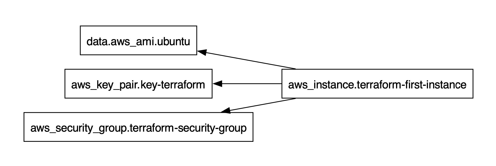

### Terraform Graph

The terraform graph command is used to generate a visual representation of either a configuration or execution plan. The output is in the DOT format, which can be used by `GraphViz` to generate charts.

Outputs the visual dependency graph of Terraform resources according to configuration files in DIR (or the current directory if omitted).

The graph is outputted in DOT format. The typical program that can read this format is `GraphViz`, but many web services are also available to read this format.

The -type flag can be used to control the type of graph shown. Terraform creates different graphs for different operations. See the options below for the list of types supported. The default type is **plan** if a configuration is given, and **apply** if a plan file is passed as an argument.  

The output of terraform graph is in the DOT format, which can easily be converted to an image by making use of dot provided by `GraphViz`:

```sh
terraform graph | dot -Tsvg > graph.svg
terraform graph | dot -Tpdf > graph.pdf
```

  
**Output:**




