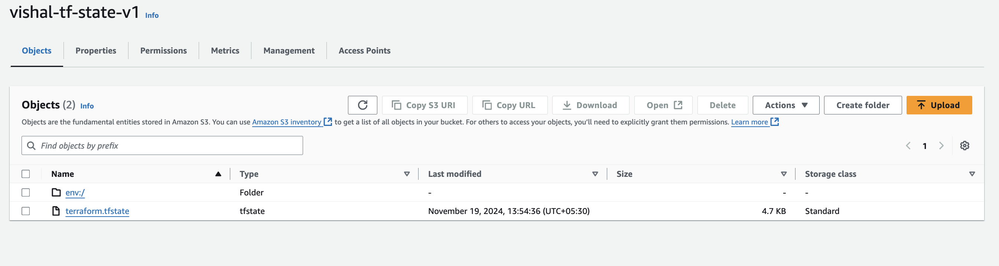

### Terraform Backend with Locking

A _backend_ in Terraform determines how state is loaded and how an operation such as apply is executed. This abstraction enables non-local file state storage, remote execution, etc.

By default, Terraform uses the **local** backend, which is the normal behavior of Terraform you're used to.

Here are some of the benefits of backends:

- **Working in a team**: Backends can store their state remotely and protect that state with locks to prevent corruption. Some backends such as Terraform Enterprise even automatically store a history of all state revisions.
- **Keeping sensitive information off disk**: State is retrieved from backends on demand and only stored in memory. If you're using a backend such as Amazon S3, the only location the state ever is persisted is in S3.
- **Remote operations**: For larger infrastructures or certain changes, terraform apply can take a long, long time. Some backends support remote operations which enable the operation to execute remotely. You can then turn off your computer and your operation will still complete. Paired with remote state storage and locking above, this also helps in team environments.

**Backends are completely optional**. You can successfully use Terraform without ever having to learn or use backends. However, they do solve pain points that afflict teams at a certain scale. If you're an individual, you can likely get away with never using backends.

Even if you only intend to use the **local** backend, it may be useful to learn about backends since you can also change the behavior of the local backend.

In this blog we are using s3 as a backend.

let's create an S3 bucket (here I am creating a bucket with the name **vishal-tf-state-v1**). and create a dynamoDB table (here I am creating it with name **vishal-dynamo-tf-state-v1**)


**aws configuration:**
```sh
vishalsingh@197NOMBT3987 19_terraform-remote-backend % aws --version
aws-cli/2.22.0 Python/3.12.6 Darwin/24.1.0 exe/x86_64

vishalsingh@197NOMBT3987 19_terraform-remote-backend % aws configure
AWS Access Key ID [None]: your_access_key_here
AWS Secret Access Key [None]: your_secret_key_here
Default region name [None]: ap-south-1
Default output format [None]: 
```

#### Permissions Required

[**S3 Bucket Permissions**](https://developer.hashicorp.com/terraform/language/backend/s3#s3-bucket-permissions)

When not using [workspaces](https://developer.hashicorp.com/terraform/language/state/workspaces)(or when only using the `default` workspace), Terraform will need the following AWS IAM permissions on the target backend bucket:

- [](https://developer.hashicorp.com/terraform/language/backend/s3#)[`s3:ListBucket`](https://developer.hashicorp.com/terraform/language/backend/s3#s3-listbucket) on `arn:aws:s3:::mybucket`. At a minimum, this must be able to list the path where the state is stored.
- [](https://developer.hashicorp.com/terraform/language/backend/s3#)[`s3:GetObject`](https://developer.hashicorp.com/terraform/language/backend/s3#s3-getobject) on `arn:aws:s3:::mybucket/path/to/my/key`
- [](https://developer.hashicorp.com/terraform/language/backend/s3#)[`s3:PutObject`](https://developer.hashicorp.com/terraform/language/backend/s3#s3-putobject) on `arn:aws:s3:::mybucket/path/to/my/key`

Note: `s3:DeleteObject` is not needed, as Terraform will not delete the state storage.

This is seen in the following AWS IAM Statement:

```json
{
  "Version": "2012-10-17",
  "Statement": [
    {
      "Effect": "Allow",
      "Action": "s3:ListBucket",
      "Resource": "arn:aws:s3:::mybucket"
    },
    {
      "Effect": "Allow",
      "Action": ["s3:GetObject", "s3:PutObject"],
      "Resource": "arn:aws:s3:::mybucket/path/to/my/key"
    }
  ]
}
```


#### Example


**variables.tf**
```json
variable "region" {
  type = string
}
variable "instance_type" {
  type = string
}
variable "access_key" {
  type = string
}
variable "secret_key" {
  type = string
}
variable "ami_id" {
  type = string
}
```

**terraform.tfvars**
```json
region        = "ap-south-1"
instance_type = "t2.micro"
access_key    = "your_access_key_here"
secret_key    = "your_secret_key_here"
ami_id        = "ami-0dee22c13ea7a9a67"
```

let's create a file with tf extension ( i am naming it as **instance.tf** )

```json
terraform {
  backend "s3" {
    bucket = "vishal-tf-state-v1"
    key    = "terraform.tfstate"
    region = "ap-south-1"
  }
}

# Configure the AWS Provider
provider "aws" {
  region     = "ap-south-1"
  access_key = var.access_key
  secret_key = var.secret_key
}

resource "aws_instance" "terraform-instance" {
  ami           = var.ami_id
  instance_type = var.instance_type
}
```

now let's run terraform init command and after that terraform apply. you can see that **terraform.tfstate** file is not stored in your local system it will be stored in your s3 bucket that you created and configured. (`vishal-tf-state-v1`).


**What to use different workspace:**

**dev-terraform.tfvars**
```json
region        = "ap-south-1"
instance_type = "t2.nano"
access_key    = "your_access_key_here"
secret_key    = "your_secret_key_here"
ami_id        = "ami-0dee22c13ea7a9a67"
```


**prod-terraform.tfvars**
```json
region        = "ap-south-1"
instance_type = "t2.micro"
access_key    = "your_access_key_here"
secret_key    = "your_secret_key_here"
ami_id        = "ami-0dee22c13ea7a9a67"
```


```sh
vishalsingh@197NOMBT3987 19_terraform-remote-backend % terraform workspace show
default
```

```sh
vishalsingh@197NOMBT3987 19_terraform-remote-backend % terraform workspace list
* default
```

```sh
vishalsingh@197NOMBT3987 19_terraform-remote-backend % terraform workspace new dev
Created and switched to workspace "dev"!

You're now on a new, empty workspace. Workspaces isolate their state,
so if you run "terraform plan" Terraform will not see any existing state
for this configuration.

vishalsingh@197NOMBT3987 19_terraform-remote-backend % terraform workspace new prod
Created and switched to workspace "prod"!

You're now on a new, empty workspace. Workspaces isolate their state,
so if you run "terraform plan" Terraform will not see any existing state
for this configuration.
```

```sh
vishalsingh@197NOMBT3987 19_terraform-remote-backend % terraform workspace select prod
```

```sh
vishalsingh@197NOMBT3987 19_terraform-remote-backend % terraform workspace show
prod
```

```sh
vishalsingh@197NOMBT3987 19_terraform-remote-backend % terraform plan   

Terraform used the selected providers to generate the following execution plan. Resource actions are indicated with the following symbols:
  + create

Terraform will perform the following actions:

  # aws_instance.terraform-instance will be created
  + resource "aws_instance" "terraform-instance" {
      + ami                                  = "ami-0dee22c13ea7a9a67"
      + arn                                  = (known after apply)
      + associate_public_ip_address          = (known after apply)
      + availability_zone                    = (known after apply)
      + cpu_core_count                       = (known after apply)
      + cpu_threads_per_core                 = (known after apply)
      + disable_api_stop                     = (known after apply)
      + disable_api_termination              = (known after apply)
      + ebs_optimized                        = (known after apply)
      + get_password_data                    = false
      + host_id                              = (known after apply)
      + host_resource_group_arn              = (known after apply)
      + iam_instance_profile                 = (known after apply)
      + id                                   = (known after apply)
      + instance_initiated_shutdown_behavior = (known after apply)
      + instance_lifecycle                   = (known after apply)
      + instance_state                       = (known after apply)
      + instance_type                        = "t2.small"
      + ipv6_address_count                   = (known after apply)
      + ipv6_addresses                       = (known after apply)
      + key_name                             = (known after apply)
      + monitoring                           = (known after apply)
      + outpost_arn                          = (known after apply)
      + password_data                        = (known after apply)
      + placement_group                      = (known after apply)
      + placement_partition_number           = (known after apply)
      + primary_network_interface_id         = (known after apply)
      + private_dns                          = (known after apply)
      + private_ip                           = (known after apply)
      + public_dns                           = (known after apply)
      + public_ip                            = (known after apply)
      + secondary_private_ips                = (known after apply)
      + security_groups                      = (known after apply)
      + source_dest_check                    = true
      + spot_instance_request_id             = (known after apply)
      + subnet_id                            = (known after apply)
      + tags_all                             = (known after apply)
      + tenancy                              = (known after apply)
      + user_data                            = (known after apply)
      + user_data_base64                     = (known after apply)
      + user_data_replace_on_change          = false
      + vpc_security_group_ids               = (known after apply)

      + capacity_reservation_specification (known after apply)

      + cpu_options (known after apply)

      + ebs_block_device (known after apply)

      + enclave_options (known after apply)

      + ephemeral_block_device (known after apply)

      + instance_market_options (known after apply)

      + maintenance_options (known after apply)

      + metadata_options (known after apply)

      + network_interface (known after apply)

      + private_dns_name_options (known after apply)

      + root_block_device (known after apply)
    }

Plan: 1 to add, 0 to change, 0 to destroy.

────────────────────────────────────────────────────────────────────────────────

Note: You didn't use the -out option to save this plan, so Terraform can't guarantee to take exactly these actions if you run "terraform apply"
now.
```

```sh
vishalsingh@197NOMBT3987 19_terraform-remote-backend % terraform apply --auto-approve

Terraform used the selected providers to generate the following execution plan. Resource actions are indicated with the following symbols:
  + create

Terraform will perform the following actions:

  # aws_instance.terraform-instance will be created
  + resource "aws_instance" "terraform-instance" {
      + ami                                  = "ami-0dee22c13ea7a9a67"
      + arn                                  = (known after apply)
      + associate_public_ip_address          = (known after apply)
      + availability_zone                    = (known after apply)
      + cpu_core_count                       = (known after apply)
      + cpu_threads_per_core                 = (known after apply)
      + disable_api_stop                     = (known after apply)
      + disable_api_termination              = (known after apply)
      + ebs_optimized                        = (known after apply)
      + get_password_data                    = false
      + host_id                              = (known after apply)
      + host_resource_group_arn              = (known after apply)
      + iam_instance_profile                 = (known after apply)
      + id                                   = (known after apply)
      + instance_initiated_shutdown_behavior = (known after apply)
      + instance_lifecycle                   = (known after apply)
      + instance_state                       = (known after apply)
      + instance_type                        = "t2.small"
      + ipv6_address_count                   = (known after apply)
      + ipv6_addresses                       = (known after apply)
      + key_name                             = (known after apply)
      + monitoring                           = (known after apply)
      + outpost_arn                          = (known after apply)
      + password_data                        = (known after apply)
      + placement_group                      = (known after apply)
      + placement_partition_number           = (known after apply)
      + primary_network_interface_id         = (known after apply)
      + private_dns                          = (known after apply)
      + private_ip                           = (known after apply)
      + public_dns                           = (known after apply)
      + public_ip                            = (known after apply)
      + secondary_private_ips                = (known after apply)
      + security_groups                      = (known after apply)
      + source_dest_check                    = true
      + spot_instance_request_id             = (known after apply)
      + subnet_id                            = (known after apply)
      + tags_all                             = (known after apply)
      + tenancy                              = (known after apply)
      + user_data                            = (known after apply)
      + user_data_base64                     = (known after apply)
      + user_data_replace_on_change          = false
      + vpc_security_group_ids               = (known after apply)

      + capacity_reservation_specification (known after apply)

      + cpu_options (known after apply)

      + ebs_block_device (known after apply)

      + enclave_options (known after apply)

      + ephemeral_block_device (known after apply)

      + instance_market_options (known after apply)

      + maintenance_options (known after apply)

      + metadata_options (known after apply)

      + network_interface (known after apply)

      + private_dns_name_options (known after apply)

      + root_block_device (known after apply)
    }

Plan: 1 to add, 0 to change, 0 to destroy.
aws_instance.terraform-instance: Creating...
aws_instance.terraform-instance: Still creating... [10s elapsed]
aws_instance.terraform-instance: Still creating... [21s elapsed]
aws_instance.terraform-instance: Still creating... [31s elapsed]
aws_instance.terraform-instance: Creation complete after 33s [id=i-0edf79aab92e05a2f]

Apply complete! Resources: 1 added, 0 changed, 0 destroyed.
```



and one more thing two or more developers can not run terraform apply at the same time.


##### How to Migrate Terraform State Between Different Backends:

To migrate from backend s3 to local machine
```sh
terraform init -migrate-state
```


#### DynamoDB State Locking

The following configuration is optional:

- [](https://developer.hashicorp.com/terraform/language/backend/s3#)[`dynamodb_endpoint`](https://developer.hashicorp.com/terraform/language/backend/s3#dynamodb_endpoint) - (Optional, **Deprecated**) Custom endpoint URL for the AWS DynamoDB API. Use `endpoints.dynamodb` instead.
- [](https://developer.hashicorp.com/terraform/language/backend/s3#)[`dynamodb_table`](https://developer.hashicorp.com/terraform/language/backend/s3#dynamodb_table) - (Optional) Name of DynamoDB Table to use for state locking and consistency. The table must have a partition key named `LockID` with type of `String`. If not configured, state locking will be disabled.


```json
terraform {
  backend "s3" {
    bucket = "vishal-tf-state-v1"
    key    = "terraform.tfstate"
    region = "ap-south-1"
    dynamodb_table = "vishal-dynamo-tf-state-v1"
  }
}

# Configure the AWS Provider
provider "aws" {
  region     = "ap-south-1"
  access_key = var.access_key
  secret_key = var.secret_key
}

resource "aws_instance" "terraform-instance" {
  ami           = var.ami_id
  instance_type = var.instance_type
}
```


**Running two terraform apply command simultaneously:**

```sh
vishalsingh@197NOMBT3987 19_terraform-remote-backend % terraform apply --auto-approve
╷
│ Error: Error acquiring the state lock
│ 
│ Error message: operation error DynamoDB: PutItem, https response error
│ StatusCode: 400, RequestID:
│ O3GSMMTC3TTAB1VBPMCPMJUBSFVV4KQNSO5AEMVJF66Q9ASUAAJG,
│ ConditionalCheckFailedException: The conditional request failed
│ Lock Info:
│   ID:        75259c57-7cbf-3ee5-88cc-78614f01fd31
│   Path:      vishal-tf-state-v1/terraform.tfstate
│   Operation: OperationTypeApply
│   Who:       vishalsingh@197NOMBT3987
│   Version:   1.9.8
│   Created:   2024-11-19 09:00:17.080042 +0000 UTC
│   Info:      
│ 
│ 
│ Terraform acquires a state lock to protect the state from being written
│ by multiple users at the same time. Please resolve the issue above and try
│ again. For most commands, you can disable locking with the "-lock=false"
│ flag, but this is not recommended.
╵
vishalsingh@197NOMBT3987 19_terraform-remote-backend % 
```

**State locking using Dynamodb**

If supported by your [backend](https://www.terraform.io/docs/backends), Terraform will lock your state for all operations that could write state. This prevents others from acquiring the lock and potentially corrupting your state.

State locking happens automatically on all operations that could write state. You won’t see any message that it is happening. If state locking fails, Terraform will not continue.